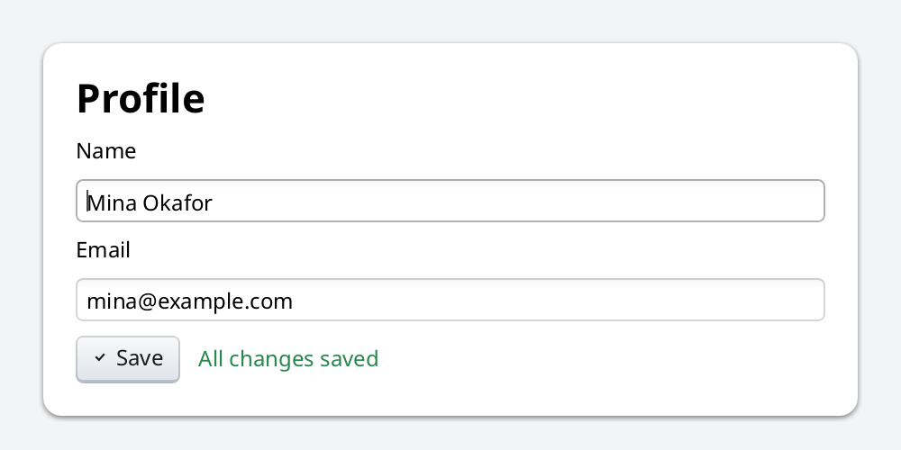
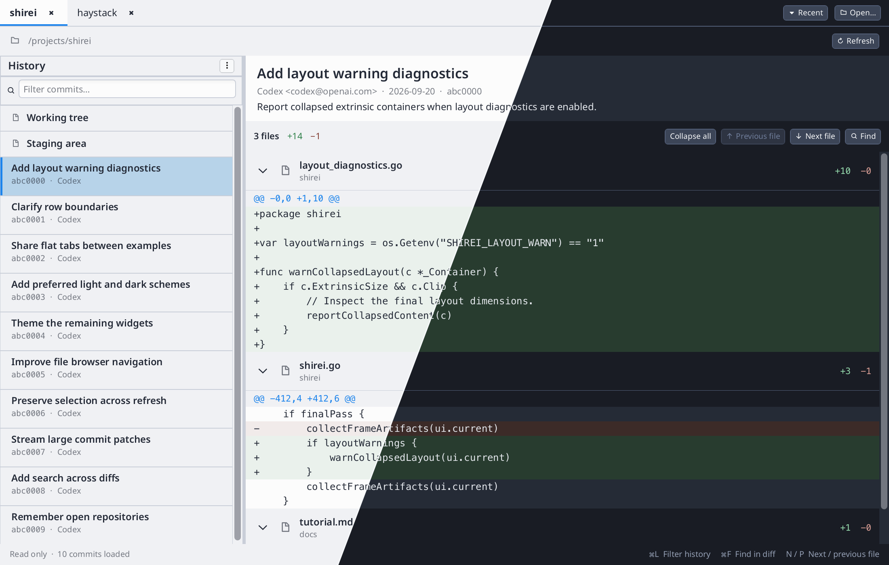
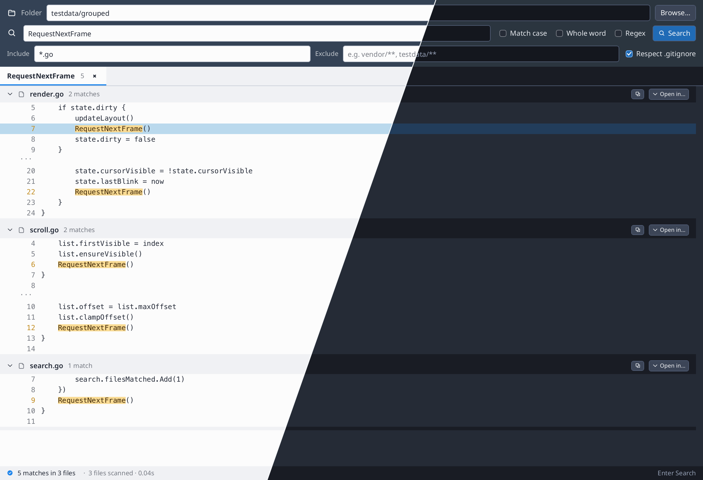
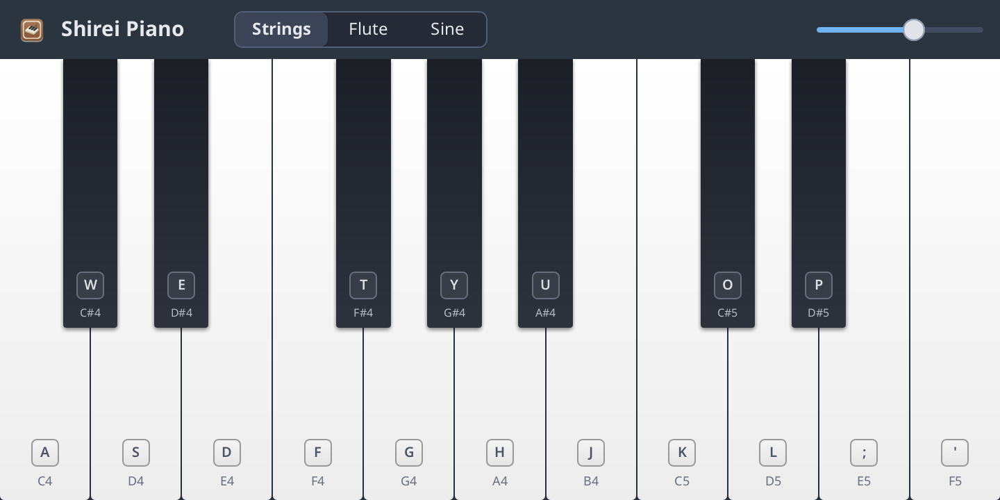
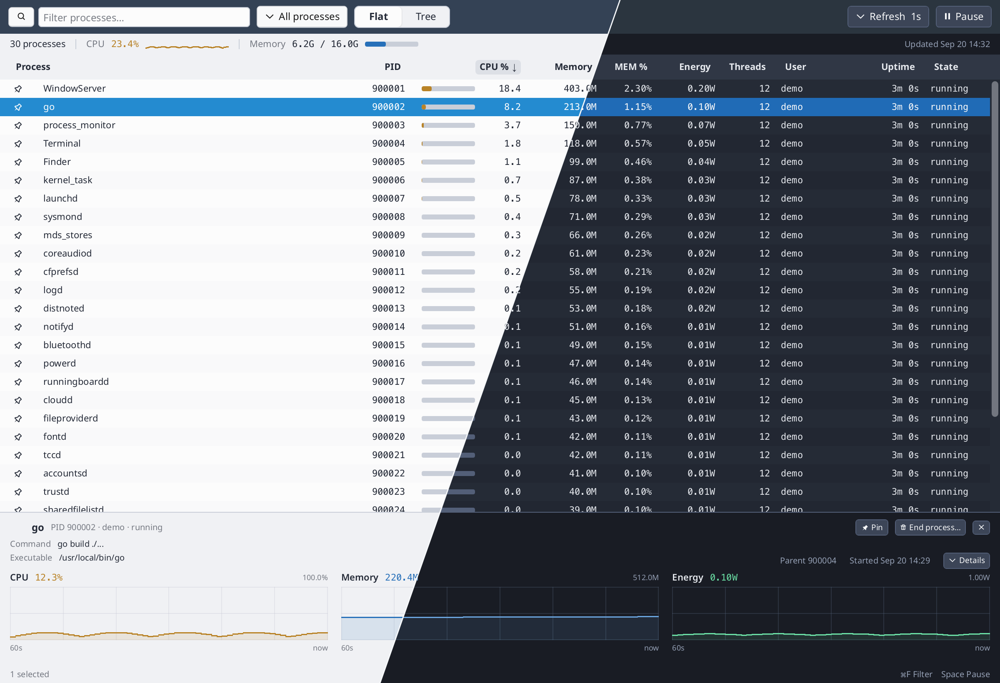

# Shirei

Shirei is a cross-platform GUI framework for Go, designed as a lightweight alternative to
web-based approaches, with a focus on development ergonomics.

* Build the UI in pure Go, instead of HTML and Javascript
* Describe the UI as a function of state, instead of creating and maintaining widget objects
* Use the good parts from the web: uniform container tree, flexbox-like layout
* Custom components can retain internal state that the caller does not have to care about



```go
func ProfileForm(profile *Profile) {
    Container(Attrs(Expand, Pad(18), Gap(8)), func() {
        Label("Profile", FontSize(22),
            FontWeight(WeightBold))

        Label("Name")
        TextInput(&profile.Name)

        Label("Email")
        TextInput(&profile.Email)

        Container(Attrs(Row, CrossMid, Gap(10)), func() {
            if Button(SymITick, "Save") {
                profile.Saved = true
            }
            if profile.Saved {
                Label("All changes saved",
                    FontSize(12),
                    TextColor(145, 55, 34, 1))
            }
        })
    })
}
```

Suitable for a wide range of utility applications.

If you find yourself resorting to TUI frameworks because you dread using Electron, give
Shirei a try.

※ "Shirei" is derived from the Japanese pronunciation of "Simple Layout":
シンプル・レイアウト → シレイ

Shirei supports all major platforms:

* Windows
* macOS
* Linux (Wayland, X11)
* iOS (iPhone)
* Android

We have several example programs in this repo:

**[Git History](examples/git_history):** quickly verify commit history (linearly)



**[Haystack](examples/haystack):** very fast "find in files"



**[Piano](examples/piano):** simple keyboard piano



**[Process Monitor](examples/process_monitor):** quickly check how running processes are
using CPU/RAM



Running a program is as easy as `go run .` or `go run ./pkg`.

We ship [`shirei_mobilerun`](cmd/shirei_mobilerun/README.md) to quickly run apps on Mobile
phones.

We also ship [`shirei_bundle`](cmd/shirei_bundle/README.md) to manage creating release
bundles for all supported target platforms.

Cross compilation works for most platforms without CGO. The exception is macOS and iOS.

## Motivation

There are several approaches to creating UIs, and it has been this author's consistent
experience that the declarative (immediate mode) provides the most flexibility and power
for the least effort, compared to other approaches.

When we say "immediate mode", we're not talking about the rendering mechanism, rather we are
talking about the API: do you "retain" widgets in your application code, or do you just say
what the UI should look like right now, given application state?

Existing GUI frameworks in Go all seem to require you to retain widgets yourself, even ones
that say they are immediate mode.

Shirei combines two powerful ideas:

* Build the UI using regular code constructs, and respond to input without callbacks
* Automatically size and layout elements based on a flexbox-like system

## Why use Shirei:

* Produce small native binaries, ≈10MB is typical for binary size.

* Performance and resource usage is a first class design consideration.

* Easy to learn API & fast iteration cycle for both humans and AI.

* Simpler UI code, focus on program data, not widget objects.

* Flexbox layout model means you have full freedom in arranging styled container trees to
build custom UIs and components.

* Batteries included: default widgets, robust text editing, virtual lists, tables, modals.

* International text support: unlike what you might expect from imgui libraries from C/C++,
Shirei supports complex text shaping and bidirectional layout, input method editor (IME) for
East Asian languages, and ability to use all system fonts.

* Snapshot testing: render the normal application frame to an image without opening a native
window or requiring a GPU.

## Limitations

* Shirei apps only have one window with standard decorations
* Accessibility support not available yet, but planned before v1.0
* No GPU surfaces at this time; under consideration

## Getting started

Copy this into `main.go` in a new folder:

```go
package main

import (
	"fmt"

	app "go.hasen.dev/shirei/app"

	. "go.hasen.dev/shirei"
	. "go.hasen.dev/shirei/widgets"
)

func main() {
	app.SetupWindow("My App", 300, 100)
	app.Run(RootView)
}

var count int

func RootView() {
	Container(Attrs(Viewport, Background(220, 10, 97, 1)), func() {
		Container(Attrs(Row, CrossMid, Pad(20), Gap(10)), func() {
			Label(fmt.Sprintf("Counter: %d", count))
			if Button(SymIPlus, "Increment") {
				count++
			}
		})
	})
}

```

Then type:

```
$ go mod init main
$ go mod tidy
$ go run .
```

You should see a window like this:

<video src="snippet-increment.mp4" autoplay playsinline loop muted></video>

## Tools

Install the companion CLIs (puts binaries on `$(go env GOPATH)/bin` — keep that
on your `PATH`):

```
go install go.hasen.dev/shirei/cmd/shirei_mobilerun@latest
go install go.hasen.dev/shirei/cmd/shirei_bundle@latest
```

| Command | Role |
|---------|------|
| **`shirei_mobilerun`** | Dev installs on iOS / Android (debug signing, fast iteration) |
| **`shirei_bundle`** | Release packaging (IPA, release APK, macOS zip/pkg, desktop archives) |

- Dev mobile setup: [docs/android.md](docs/android.md), [docs/ios.md](docs/ios.md)
- Bundle details: [cmd/shirei_bundle/README.md](cmd/shirei_bundle/README.md)
- Mobilerun details: [cmd/shirei_mobilerun/README.md](cmd/shirei_mobilerun/README.md)
- App resources (`Resources/` + `app.ResourcePath`): [docs/resources.md](docs/resources.md)

## Learn

- [Tutorial](docs/tutorial.md)
- [Layout shell (step-by-step)](docs/layout-tutorial.md)
- [Audio](docs/audio-tutorial.md)
- [App resources](docs/resources.md)
- [Virtual lists and Measure](docs/virtual-list.md)
- [Container identity](docs/identity.md)
- [Drag and drop](docs/drag-drop.md)
- [Running on Android](docs/android.md) (`shirei_mobilerun`)
- [Running on iOS](docs/ios.md) (`shirei_mobilerun`)
- [Mobile extensions / escape hatches](docs/mobile-extensions.md)
- [Release packaging (`shirei_bundle`)](cmd/shirei_bundle/README.md)
