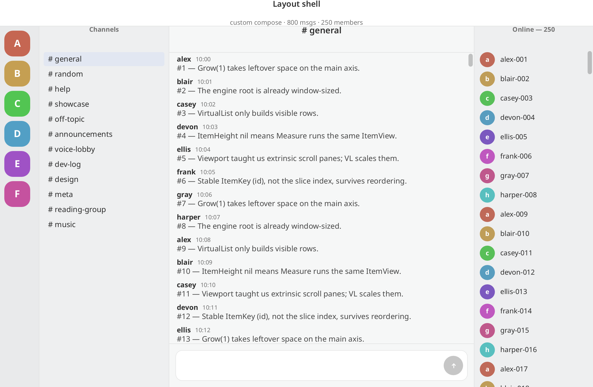
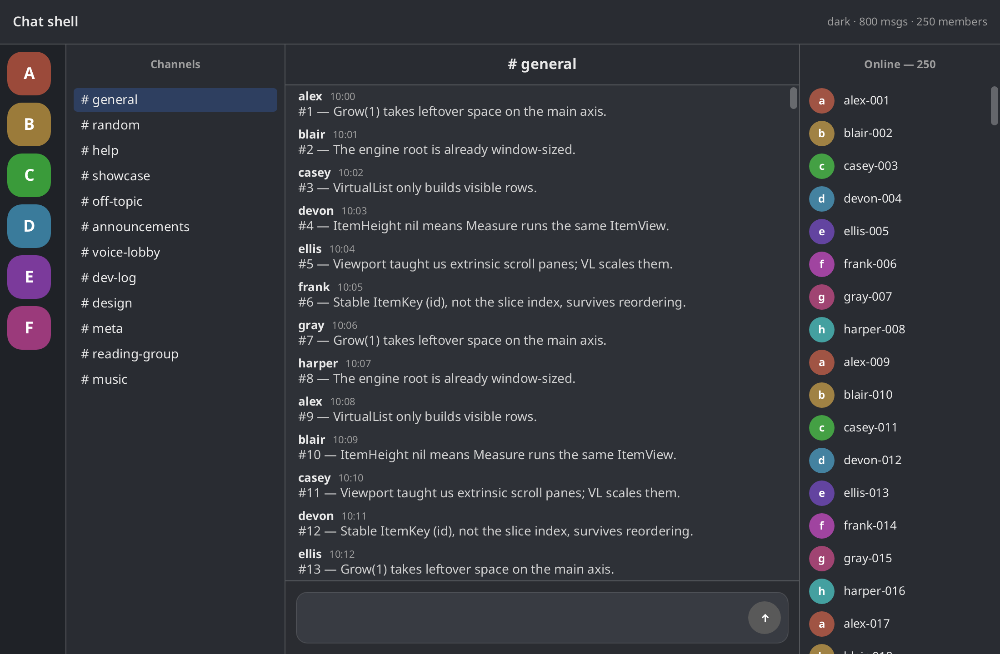

# Custom widgets: process, paint, and a chat compose bar

This is a **follow-up** to the [layout tutorial](layout-tutorial.md). Layout
taught multi-panel structure (shell, Extrinsic, Viewport, VirtualList). This
tutorial teaches a different skill: **how Shirei expects you to customize
interactive controls**.

We build on layout **step 14** in two product steps:

1. **Philosophy** — process vs presentation  
2. **A flat button** — easiest way into the model  
3. **A text field** — process plus plain text/caret draw  
4. **Compose** — put the button next to the field in one chrome box  
5. **Dark shell** — recolor the finished chat and optionally retint the
   package default scrollbar for dark panels  

Runnable samples (each is a full window you can open while reading):

| Step | Code | What you learn |
|------|------|----------------|
| 14 | [layout step 14](../demos/layout-shell/step14/main.go) | Starting shell (default compose) |
| 15a | [`step15a/main.go`](../demos/layout-shell/step15a/main.go) | Custom send circle, **default** text field |
| 15 | [`step15/main.go`](../demos/layout-shell/step15/main.go) | Full custom compose (pill + field + send) |
| 16 | [`step16/main.go`](../demos/layout-shell/step16/main.go) | Dark theme + light scrollbar tint |

```bash
cd shirei
go run ./demos/layout-shell/step14    # before: default field + default Send
go run ./demos/layout-shell/step15a   # custom circle, default field
go run ./demos/layout-shell/step15    # full custom compose
go run ./demos/layout-shell/step16    # dark shell
```

Screenshots of the shell appear **with each section** below (and again in
the recap). The progression is easier to see in order than only at the top.

---

## Prerequisites

Finish [layout-tutorial.md](layout-tutorial.md) through **step 14**, or at
least run and skim
[`step14/main.go`](../demos/layout-shell/step14/main.go). You should know
containers, `Attrs`, rows/columns, and that compose is already a layout slot.

Optional deeper references (not required to follow along):

- Gallery demos: [custom-buttons](../demos/custom-buttons/),
  [custom-textinputs](../demos/custom-textinputs/)

---

## 1. Philosophy: process vs presentation

Default widgets (`Button`, `TextInput`, …) are **convenience packages**: they
wire up interaction **and** draw a default look. That is fine until the
default look is wrong for your app.

A common industry move is to invent “themes,” skin interfaces, or
`Draw(state)` callbacks the framework calls. Shirei takes a simpler, more
immediate-mode path:

> **You own the container.**  
> **We provide functions that process input for the current container.**  
> **You paint whatever you want from the snapshot they return.**

There is no plug-in skin object. There is no inverted “framework calls your
draw.” You build the tree; when you need “is this box hovered / clicked /
being edited?”, you call a **process** helper on that box.

```text
  ┌─────────────────────────────────────────┐
  │  your Container (you set size, pad, bg) │
  │                                         │
  │   st := Process…Events(...)             │  ← interaction (and for text, edits)
  │   // use st.Hovered, st.Clicked, …      │
  │   Label / Icon / Draw…                  │  ← presentation (yours, or plain helpers)
  └─────────────────────────────────────────┘
```

### Why this shape?

- **State depends on the box.** Hover, press, and focus are about *this*
  container’s id and geometry. Handing state into a nested “view callback”
  the shell owns is circular — the shell would need the view to exist before
  it could compute the state the view needs.
- **Data-centric.** Process returns a plain snapshot (`Hovered`, `Clicked`,
  caret position, …). You branch and paint; you do not implement an interface.
- **Defaults are thin.** `Button` is process + a default face. `TextInput` is
  process + plain text/caret draw + a little default chrome. You can drop to the
  same building blocks anytime.

### The one rule that bites

`ModAttrs` must run **before** any child is added (labels, icons, draw
helpers). Process helpers are written so they **do not create children**, so
this stays legal:

```go
st := ProcessButtonEvents(false)
if st.Hovered {
    ModAttrs(Background(...)) // OK — no children yet
}
Icon(...) // children only after attrs are settled
```

---

## 2. Warm-up: a flat custom button

Buttons are the easiest place to learn the model. Interaction is just
pointer press/release; you draw everything yourself.

### What the library provides

```go
st := ProcessButtonEvents(disabled bool) ButtonState
// st.Hovered, st.Active, st.Clicked, st.Disabled, st.Local
```

That is the whole interaction contract for a clickable box. Default
`Button` / `CtrlButton` call the same idea under the hood and then paint an
accent face. You can skip the default face entirely.

### A circular “send” control

In the chat shell we will want a circle with an arrow, not a labeled
rectangle. That is still just process + paint:

```go
func sendCircle(disabled bool) bool {
    const size float32 = 36
    var clicked bool
    accent := Vec4{220, 55, 52, 1}
    if disabled {
        accent = Vec4{0, 0, 78, 1}
    }

    Container(Attrs(FixSize(size, size), Corners(size/2),
        BackgroundVec(accent), Center), func() {
        st := ProcessButtonEvents(disabled)
        clicked = st.Clicked
        if st.Hovered && !disabled {
            ModAttrs(Background(220, 55, 48, 1))
        }
        if st.Active && !disabled {
            ModAttrs(Background(220, 55, 42, 1))
        }
        Icon(TypArrowUp, FontSize(18), TextColor(0, 0, 100, 1))
    })
    return clicked
}
```

**What to notice:**

- The **circle is your container** — size, corners, fill are presentation.
- **Process** only answers “what is the pointer doing to *this* box?”
- Disable by passing `true` when there is nothing to send; process will not
  report a click.

Optional gallery of other faces (Material flat, XP Luna, Win98 bevel):
[`demos/custom-buttons/`](../demos/custom-buttons/).

### On the chat shell (still a default field)

Drop that circle next to the default `TextInputExt` from layout step 14 — you
do **not** need a custom field yet. Intermediate sample:

[`demos/layout-shell/step15a/main.go`](../demos/layout-shell/step15a/main.go)


Compare to default send on the same shell:


**What to notice:** Only the control you care about changed. The list, rails,
and text field are still default. That is the process/paint model working at
call-site scale.

---

## 3. Text fields: process *and* plain paint

Text is harder than buttons: keys, selection, scroll, IME, caret blink. We
still separate **process** from **chrome**, but we also ship **plain paint**
helpers so you do not reimplement a text editor.

### Two layers

| Function | Responsibility |
|----------|----------------|
| `ProcessTextInput(buf, cfg)` | Focus, hooks, edit model, clipboard, IME rules. **No children.** Returns a snapshot. |
| `DrawTextInputPlain(st, cfg)` | Scrollable text, selection, composition marks, blinking caret. |

You own the **field box** (border, background, padding of the control as a
product). We own **editing** and a **default way to draw the text and caret**
— but you choose **where** to call the draw helpers (inside your box, after
your chrome attrs).

```go
Container(Attrs(Focusable, Clip, PadVec(cfg.Padding), /* your chrome */), func() {
    st := ProcessTextInput(buf, cfg)
    if st.HasFocus {
        ModAttrs(/* focus chrome — still before children */)
    }
    DrawTextInputPlain(st, cfg) // text + cursor, wherever you placed this call
})
```

### Why paint helpers for text but not for buttons?

A button face is a few rectangles and a label — easy to reinvent. A correct
field is not. Requiring every app to redraw caret affinity, composition
underlines, and scroll-to-caret would fight the “customize chrome” goal. So:

- **Buttons:** process only; presentation is entirely yours.  
- **Text:** process + optional plain draw; presentation of the **chrome** is
  yours; presentation of **glyphs and caret** can be the library’s.

You can still style text/caret colors via `TextInputConfig` when needed. You
are free to call `DrawTextInputContent` / `DrawTextInputCaret` separately if
you want them in different places (advanced).

### Contract worth remembering

- Call `ProcessTextInput` **inside** the focusable field container.  
- That container’s **padding** is the text geometry padding (caret and
  hit-testing).  
- Process creates **no children** (so focus `ModAttrs` stays legal).  

Gallery of field skins only: [`demos/custom-textinputs/`](../demos/custom-textinputs/).

You will see a borderless field **in context** in the next section (inside
the compose pill). Until then, the gallery demos are the best place to try
field chrome alone without the whole chat shell.

---

## 4. Put them together: the compose bar

Layout step 14 ends with a practical but plain strip:

```go
Container(Attrs(Expand, Pad(10), Gap(8), Row, CrossMid, Background(220, 6, 95, 1)), func() {
    a := DefaultTextInputAttrs()
    a.NoAutoFocus = true
    TextInputExt(&draft, a)
    if Button(0, "Send") && draft != "" {
        draft = ""
    }
})
```

A default field next to a default button works. Modern chat-style UIs usually
want **one chrome surface** that houses both: generous outer padding, a
rounded “pill,” a quiet multi-line field, and a compact send control.

```text
[  pad  ]
[  rounded pill:  [ multi-line field .............. ]  (↑)  ]
[  pad  ]
```

That is just **§2 + §3 in one row** — not a new API.

### Step A — Helper on the shell

Keep the layout shell from step 14; only replace the compose strip:

```diff
-				Container(Attrs(Expand, Pad(10), Gap(8), Row, CrossMid, Background(...)), func() {
-					TextInputExt(&draft, ...)
-					if Button(0, "Send") && draft != "" { draft = "" }
-				})
+				chatCompose(&draft, &messages, textPrim)
```

### Step B — Outer pad + pill (chrome only)

```go
func chatCompose(draft *string, messages *[]msg, textPrim float32) {
    Container(Attrs(Expand, Pad(12), Background(...)), func() {
        Container(Attrs(Expand, Row, CrossMid, Gap(8),
            Pad2(6, 8), Corners(12),
            Background(0, 0, 100, 1),
            BorderWidth(1), BorderColor(0, 0, 0, 0.08),
        ), func() {
            // field (step C) + send circle (step D)
        })
    })
}
```

The **pill** is product chrome. The field inside will stay visually quiet.

### Step C — Field inside the pill

```go
cfg := TextInputConfig{
    FontSize: DefaultTextSize,
    Padding:  N4(10),
    Wrap: true, MaxLines: 0, Rows: 2,
    NoAutoFocus: true,
    TextColor:   Vec4{0, 0, textPrim, 1},
}
// boxH from rows + padding...

Container(Attrs(
    Focusable, Clip, Grow(1),
    PadVec(cfg.Padding),
    MinSize(80, boxH), MaxSizeVec(Vec2{0, boxH}),
    Background(0, 0, 100, 0), // transparent — pill is the chrome
), func() {
    st := ProcessTextInput(draft, cfg)
    if st.HasFocus {
        ModAttrs(Background(220, 10, 98, 1))
    }
    DrawTextInputPlain(st, cfg)
})
```

**What to notice:** Default `TextInputExt` would draw its own border and
underline. Here the pill already frames the control, so the field is
transparent and only process + plain text/caret remain.

### Step D — Send circle in the same pill

Reuse the §2 idea next to the field (`Grow(1)` on the field leaves a fixed
circle on the right):

```go
canSend := *draft != ""
Container(Attrs(FixSize(36, 36), Corners(18),
    BackgroundVec(accentOrGray), Center), func() {
    bst := ProcessButtonEvents(!canSend)
    // hover / press ModAttrs, then Icon...
    if bst.Clicked && canSend {
        text := *draft
        *draft = ""
        *messages = append(*messages, msg{
            id: len(*messages) + 1, author: "you",
            body: text, time: time.Now().Format("15:04"),
        })
    }
})
```

Messages already use `VirtualListView` with stable ids from layout step 14 —
append is enough; no layout rewrite.

### Full source

[`demos/layout-shell/step15/main.go`](../demos/layout-shell/step15/main.go)

```bash
cd shirei
go run ./demos/layout-shell/step15
```



**What to notice:** One pill holds both process helpers. The shell above the
strip is still the light layout from step 14; only compose product chrome
changed relative to 15a (default field → borderless field + shared pill).

---

## 5. Dark shell (and retinting the default scrollbar)

Step 15 left you with a working chat **product control** (compose) on a
**light** shell. The package default scrollbar is already a **modern
overlay** (transparent track, thin rounded neutral-gray thumb, darker on
hover/drag). On a dark product UI that mid-gray pill can look too quiet — and
`VirtualList` draws a bar for you, so you cannot “just forget” it.

This section does two finishing moves on the same shell:

1. Switch the palette to a dark chat look.  
2. Optionally retint the **app-wide** scrollbar once so every list picks up a
   light thumb that reads on dark panels.

Full sample:
[`demos/layout-shell/step16/main.go`](../demos/layout-shell/step16/main.go)

```bash
cd shirei
go run ./demos/layout-shell/step16
```



### Package default is already modern

You do **not** need to implement an overlay bar to get the modern look.
`ScrollBars()`, `VirtualListView`, and menus use `DefaultScrollBarStyle`
unless you override it:

| Idle | Mid-gray translucent pill |
|------|---------------------------|
| Hover | Slightly darker / more opaque |
| Drag | Darker still (still neutral — no accent) |
| Track | Transparent (content shows through) |

`SetDefaultScrollBar(nil)` restores that package style.

Themed skins (classic white-track, Win98, cool blue, …) live in
[`demos/custom-scrollbars/`](../demos/custom-scrollbars/).

### Why a global scrollbar setting?

Buttons and text fields are things **you call yourself**:

```go
if Button(0, "Send") { ... }
TextInputExt(&draft, attrs)
```

When you want a different look, you either pass attrs at that call site or
build a custom control with `Process…` (as in §§2–4). That is natural —
the call site *is* the product decision.

Scrollbars are different. Most of the time **you never call them**. Other
widgets do:

- `VirtualListView` paints a bar for long lists  
- Menus and similar chrome may call `ScrollBars()`  
- Your own `ScrollOnInput` panes call `ScrollBars()` when you remember  

So retinting bars for a dark shell is **app chrome**, not a parameter on
every list:

```go
// once, typically in main before app.Run:
SetDefaultScrollBar(darkShellScrollBar)

// every default path uses it:
ScrollBars()                    // your panes
// VirtualListView → ScrollBars() internally
```

**What this is not:** a full theming system for every widget. Buttons still
use package defaults unless you process/paint them (or pass accents). Scrollbars
get a global hook because they are **nested chrome** shared by many widgets.

### Light thumb for dark panels

You do **not** reimplement drag math. You call `ScrollBarExt` with chrome
options and an optional thumb painter — same geometry as the package
default, different face:

```go
func darkShellScrollBar() ContainerId {
    return ScrollBarExt(ScrollBarAttrs{
        TrackBG:        Vec4{}, // transparent track
        ThumbMinHeight: 24,
        Thumb: func(size Vec2) {
            r := size[0] / 2
            if r < 1 {
                r = 1
            }
            Element(Attrs(
                FixSizeVec(size),
                Corners(r),
                Background(0, 0, 100, 0.28), // light pill on dark panels
            ))
        },
    })
}
```

`ScrollBarExt` always draws with **no layout animation** (track and thumb snap
with the scroll offset).

| You control | How |
|-------------|-----|
| Track width | `TrackWidth` (zero: `SCROLLBAR_WIDTH` hit target) |
| Track fill | `TrackBG` (zero = transparent) |
| Inner pad | `TrackPad` |
| Shortest thumb | `ThumbMinHeight` |
| Thumb face paint | `Thumb` callback — **size only**; no interaction |

| The framework keeps | |
|---------------------|--|
| When the bar is needed | Content taller than the viewport |
| Thumb length / position from scroll | Geometry from layout |
| Click track to jump | Inside `ScrollBarExt` |
| Drag thumb | Inside `ScrollBarExt` |
| Wheel / `ScrollOnInput` | Separate; still your pane |

### Registering the default

```go
func main() {
    SetDefaultScrollBar(darkShellScrollBar)
    app.SetupWindow("…", winW, winH)
    app.Run(frame)
}
```

Do this **once** at startup, not every frame. After that, step 15’s
`VirtualListView` for messages and members automatically shows the light
thumb — no new VL parameters.

If one pane must differ, call `ScrollBarExt(…)` (or another `ScrollBarFn`)
**at that site** instead of `ScrollBars()`. The global default is only what
`ScrollBars()` uses.

### Dark palette (same structure, new constants)

Layout step 13 already taught “swap loud debug colors for a calm palette.”
Dark is the same idea with different HSLA numbers:

```go
const (
    bgApp, bgSide, bgMain float32 = 16, 18, 20
    textPrim, textMuted   float32 = 92, 62
    borderA               float32 = 0.22 // light lines need more alpha on dark
)
ModAttrs(Background(220, 10, bgApp, 1))
// … Background(220, 10, bgSide, 1) on rails, TextColor(0, 0, textPrim, 1), …
```

Compose (§4) keeps the same process/paint structure; only fills and borders
move to darker values so the pill reads as raised chrome on the strip.

### Section titles: center in the header bar

In a **column** parent, `CrossMid` only centers **horizontally**. A label in
a fixed-height header still sits on the **top** of that bar unless you also
center on the main (vertical) axis.

```go
// Stuck to the top edge of the 44px bar:
Container(Attrs(Expand, FixHeight(44), Pad2(0, 12), CrossMid), ...)

// Vertically and horizontally centered:
Container(Attrs(Expand, FixHeight(44), Pad2(0, 12), Center), ...)
// Center == MainAlign(AlignMiddle) + CrossAlign(AlignMiddle)
```

Step 16 uses a small `sectionTitle` helper so “Channels”, “# general”, and
“Online” share that centering.

### What changed vs step 15

| | Step 15 | Step 16 |
|--|---------|---------|
| Palette | Light greys | Dark surfaces, light text |
| Scrollbar | Package modern (gray) | `SetDefaultScrollBar` light thumb for dark |
| Compose | Custom process/paint | Same structure, dark colors |
| Headers | `CrossMid` only | `Center` (vertical + horizontal) |
| Shell / VL / compose layout | Unchanged | Unchanged |

You did not re-learn Extrinsic or VirtualList. You learned **where product
chrome lives**: call-site for controls you invent; package default for bars
nested widgets draw for you — override only when the product palette needs it.

---

## Recap

| Stage | You learn |
|-------|-----------|
| Philosophy | You own containers; process returns data; you present |
| Flat button | `ProcessButtonEvents` + your paint |
| Text field | `ProcessTextInput` + `DrawTextInputPlain` (chrome yours; glyphs/caret optional helpers) |
| Compose | Same two pieces in one chrome box on the chat shell |
| Dark shell | Palette polish; optional light scrollbar tint via `SetDefaultScrollBar` |

| Default convenience | Building blocks |
|-------------------|-----------------|
| `Button` | `ProcessButtonEvents` + paint |
| `TextInputExt` | field container + `ProcessTextInput` + `DrawTextInputPlain` (+ optional chrome) |
| `ScrollBars()` (modern overlay) | `ScrollBarExt` + optional `SetDefaultScrollBar` |

Layout (Extrinsic / Viewport / VirtualList) did not need to change for
compose. For scrollbars on a dark shell, you also did not change VirtualList —
you changed what `ScrollBars()` means for the process.

### Final results (same images as above)

Light shell, full custom compose (package modern scrollbar):


Dark shell, light scrollbar tint:


```bash
cd shirei
go run ./demos/layout-shell/step15
go run ./demos/layout-shell/step16
```

---

## Common mistakes

- `ModAttrs` **after** `Icon` / `DrawTextInputPlain` (panic).  
- Default field chrome **and** pill chrome (double borders).  
- Calling `Button(0, "Send")` and considering the control “custom.”  
- Changing Extrinsic/Viewport while redesigning compose — usually unnecessary.  
- Calling `ProcessTextInput` outside the focusable field container (hooks and
  focus attach to the wrong node).  
- Expecting `CrossMid` alone to vertically center a header label in a column.  
- Reimplementing thumb drag — use `ScrollBarExt` / the package default instead.  
- Building a “modern” bar from scratch when `DefaultScrollBarStyle` already is one.  
- Passing scrollbar attrs into every `VirtualListView` when a single
  `SetDefaultScrollBar` would do for a product-wide tint.

---

## Related

| | |
|--|--|
| Layout shell (01–14) | [layout-tutorial.md](layout-tutorial.md) |
| Custom send only (step 15a) | [`demos/layout-shell/step15a/`](../demos/layout-shell/step15a/) |
| Compose sample (step 15) | [`demos/layout-shell/step15/`](../demos/layout-shell/step15/) |
| Dark shell (step 16) | [`demos/layout-shell/step16/`](../demos/layout-shell/step16/) |
| Scrollbar skins gallery | [`demos/custom-scrollbars/`](../demos/custom-scrollbars/) |
| Button skins gallery | [`demos/custom-buttons/`](../demos/custom-buttons/) |
| Field skins gallery | [`demos/custom-textinputs/`](../demos/custom-textinputs/) |
