# Building a chat-shell layout in Shirei

This tutorial builds a multi-panel **chat shell** one step at a time. Early
steps use loud colors so every container “box” is obvious; later steps fill
them with content and polish to a **light** chrome.

It is for humans learning layout and for AI agents that need runnable samples.

Inspired by multi-column chat apps; this is **not** a product clone.

## How this tutorial is written

- **Step 01** shows a complete small program (starting point).
- **Later steps** show only **what changed**, as one or more ` ```diff ` chunks,
  with a short note on each chunk.
- **Full source** for every step lives under
  [`demos/layout-shell/`](../demos/layout-shell/) — follow the link if you want
  the whole file.
- Diffs deliberately **omit** noise: file-header comments, `SetupWindow` title
  strings, and dummy chat copy you can ignore. Focus on `frame` (and data only
  when it matters).

**Engine root:** `frameFn` already runs inside a window-sized, clipped root.
Do **not** wrap the whole UI in `Viewport` as an “app root.”

**Compose appears early:** step **05** subdivides main into header / messages /
compose. Steps **09–11** teach why the messages pane needs **`Extrinsic` /
`Viewport`**. Compose becomes a real `TextInput` when messages are filled.

| Steps | Focus |
|-------|--------|
| 01–04 | Outer shell |
| **05** | Main: header · messages · **compose** |
| 06–08 | Labels, servers, channels |
| **09–11** | Messages + Extrinsic / Viewport |
| 12–13 | Members + light polish |
| 14 | VirtualList at scale |

**Final result (step 14):**


When the shell is solid, a separate tutorial builds a **custom compose bar**
(padded field + circular send, typical of modern chat-style UIs) on top of
step 14 — process APIs, not more Extrinsic/Viewport:
[custom-widgets-tutorial.md](custom-widgets-tutorial.md).

## Prerequisites

Skim [tutorial.md](tutorial.md) for containers, `Attrs`, and `Label`.

## How to run a step

```bash
cd shirei
go run ./demos/layout-shell/step05
go run ./demos/layout-shell/step09   # intentional bug
./demos/layout-shell/gen-pngs.sh
```

Screenshots are **1100×720**.

---

## Wireframe

```text
┌──────────────────────── top bar ─────────────────────────┐
├────┬────────────┬─────────────────────────┬──────────────┤
│ S  │  channels  │  header                 │   members    │
│ e  │            ├─────────────────────────┤              │
│ r  │            │  messages (scroll)      │              │
│ v  │            ├─────────────────────────┤              │
│ e  │            │  compose (TextInput)    │              │
└────┴────────────┴─────────────────────────┴──────────────┘
```

| Tool | Role |
|------|------|
| Engine root | Window-sized + clipped |
| `Grow` / `Row` / column | Flex shell |
| **`Extrinsic`** / **`Viewport`** | Budgeted scroll panes |
| `TextInput` | Real compose field |
| `VirtualListView` | Large lists (step 14) |

---

## Step 01 — The engine root

Style the engine root with `ModAttrs` — no outer `Viewport` window.

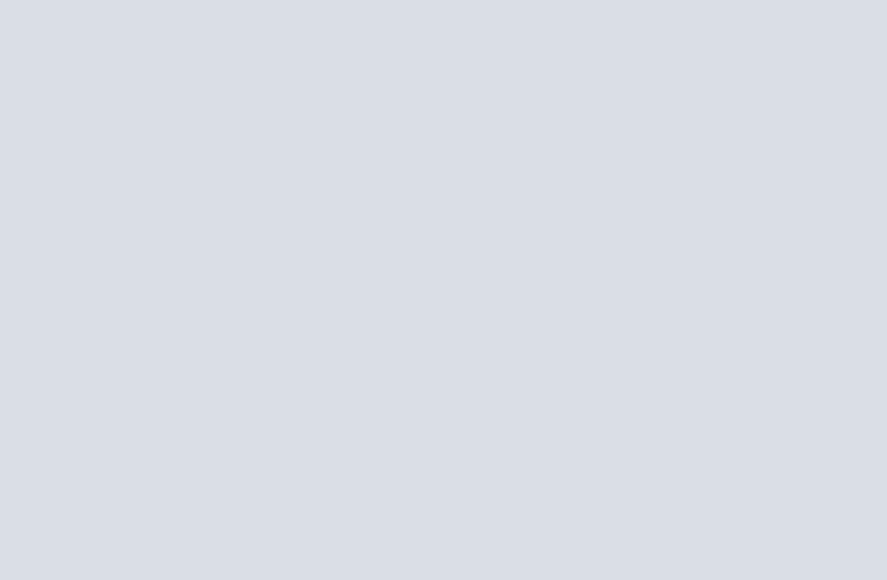

**Full source:** [`demos/layout-shell/step01/main.go`](../demos/layout-shell/step01/main.go)

```bash
go run ./demos/layout-shell/step01
```

```go
package main

import (
	"fmt"
	"os"

	"go.hasen.dev/shirei/app"

	. "go.hasen.dev/shirei"
)

const winW, winH = 1100, 720

func main() {
	if len(os.Args) >= 3 && os.Args[1] == "--png" {
		if err := RenderToPNG(os.Args[2], winW, winH, frame); err != nil {
			fmt.Fprintln(os.Stderr, err)
			os.Exit(1)
		}
		return
	}
	app.SetupWindow("Layout shell — step 01", winW, winH)
	app.Run(frame)
}

func frame() {
	// frameFn already runs inside an engine-created root: Min/Max/resolved size
	// = WindowSize, Clip = true. You do not add a Viewport "window root".
	// Style the current container (the root) before adding children:
	ModAttrs(Background(220, 20, 88, 1))
}
```

**What to notice:** Agents often wrap everything in `Viewport`. The engine
already created a full-window root. `Viewport` is for **nested** fill-and-scroll
panes (we introduce it properly after a real bug in step 09).

The `main` + `--png` boilerplate is the same in every step — later diffs skip it.

---

## Step 02 — Top bar + body

Split the root column: fixed-height top, growing body.

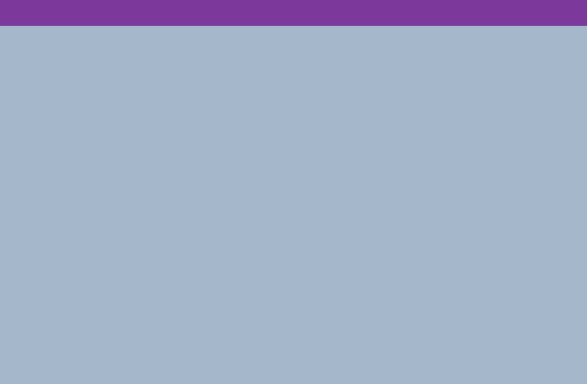

**Full source:** [`step02/main.go`](../demos/layout-shell/step02/main.go)

Replace the single `ModAttrs` paint with two children of the root:

```diff
 func frame() {
-	ModAttrs(Background(220, 20, 88, 1))
+	// Top bar: fixed height, does not grow.
+	Container(Attrs(Expand, FixHeight(48), Background(280, 45, 42, 1)), func() {})
+
+	// Body: Grow(1) takes all remaining height on the main axis.
+	Container(Attrs(Grow(1), Expand, Background(210, 25, 72, 1)), func() {})
 }
```

**What to notice:** The root is a **column**. `Grow(1)` claims leftover
**height**. The top bar stays 48px.

---

## Step 03 — Server rail + rest

Turn the body into a **row**: narrow rail + growing rest.

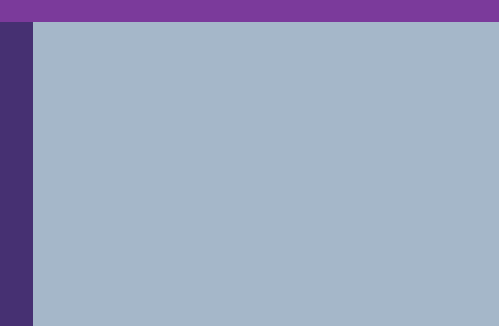

**Full source:** [`step03/main.go`](../demos/layout-shell/step03/main.go)

```diff
 func frame() {
 	Container(Attrs(Expand, FixHeight(48), Background(280, 45, 42, 1)), func() {})
 
-	Container(Attrs(Grow(1), Expand, Background(210, 25, 72, 1)), func() {})
+	// Body is a row: fixed-width rail + growing rest.
+	Container(Attrs(Row, Grow(1), Expand), func() {
+		Container(Attrs(FixWidth(72), Expand, Background(260, 40, 32, 1)), func() {})
+		Container(Attrs(Grow(1), Expand, Background(210, 25, 72, 1)), func() {})
+	})
 }
```

**What to notice:** In a `Row`, `Grow(1)` claims leftover **width**. `FixWidth(72)`
keeps the rail narrow.

---

## Step 04 — Channels | main | members

Split the “rest” into three columns.

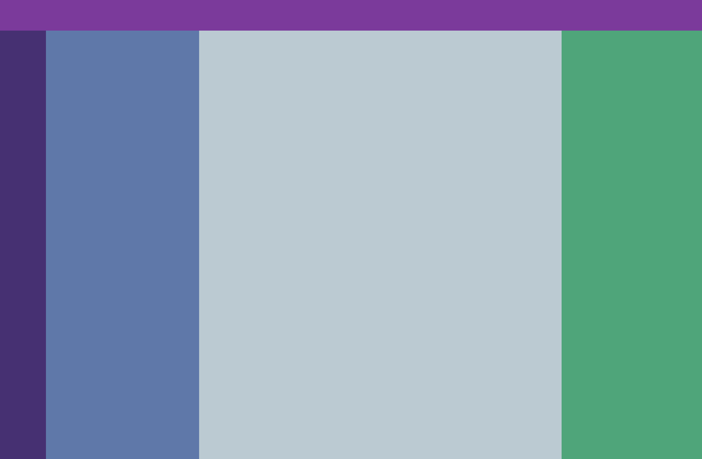

**Full source:** [`step04/main.go`](../demos/layout-shell/step04/main.go)

```diff
 	Container(Attrs(Row, Grow(1), Expand), func() {
 		Container(Attrs(FixWidth(72), Expand, Background(260, 40, 32, 1)), func() {})
-		Container(Attrs(Grow(1), Expand, Background(210, 25, 72, 1)), func() {})
+		// Rest of the body: three columns
+		Container(Attrs(Row, Grow(1), Expand), func() {
+			Container(Attrs(FixWidth(240), Expand, Background(220, 30, 52, 1)), func() {})
+			Container(Attrs(Grow(1), Expand, Background(200, 20, 78, 1)), func() {})
+			Container(Attrs(FixWidth(220), Expand, Background(150, 35, 48, 1)), func() {})
+		})
 	})
```

**What to notice:** Classic app chrome — fixed side panels, growing center.
You can nest rows freely.

---

## Step 05 — Main: header | messages | compose

Subdivide the **center** column so compose is a permanent layout slot (not a
late surprise).


**Full source:** [`step05/main.go`](../demos/layout-shell/step05/main.go)

### Chunk 1 — Optional labels on the outer panes

(Also adds `Center` so the labels read cleanly.)

```diff
-		Container(Attrs(FixWidth(72), Expand, Background(260, 40, 32, 1)), func() {})
+		Container(Attrs(FixWidth(72), Expand, Background(260, 40, 32, 1), Center, Pad(4)), func() {
+			Label("servers", FontSize(12), FontWeight(WeightSemibold), TextColor(0, 0, 100, 1))
+		})
```

Same idea for channels and members (labels only).

### Chunk 2 — The important change: three rows inside main

```diff
-			Container(Attrs(Grow(1), Expand, Background(200, 20, 78, 1)), func() {})
+			// Main column: three rows — header, growing messages, fixed compose.
+			Container(Attrs(Grow(1), Expand, Background(200, 20, 78, 1)), func() {
+				Container(Attrs(Expand, FixHeight(48), Background(200, 25, 70, 1), Center), func() {
+					Label("header", FontSize(14), FontWeight(WeightSemibold), TextColor(0, 0, 100, 1))
+				})
+				Container(Attrs(Grow(1), Expand, Background(200, 15, 82, 1), Center), func() {
+					Label("messages", FontSize(14), FontWeight(WeightSemibold), TextColor(0, 0, 100, 1))
+				})
+				Container(Attrs(Expand, FixHeight(56), Background(200, 30, 65, 1), Center), func() {
+					Label("compose", FontSize(14), FontWeight(WeightSemibold), TextColor(0, 0, 100, 1))
+				})
+			})
```

**What to notice:** Chat main is its own column recipe: fixed header · growing
middle · fixed compose. That structure stays for the rest of the tutorial.

---

## Step 06 — Name every region

Mostly the same layout as step 05 (labels already present). Top bar gets a
label too. No structural change.

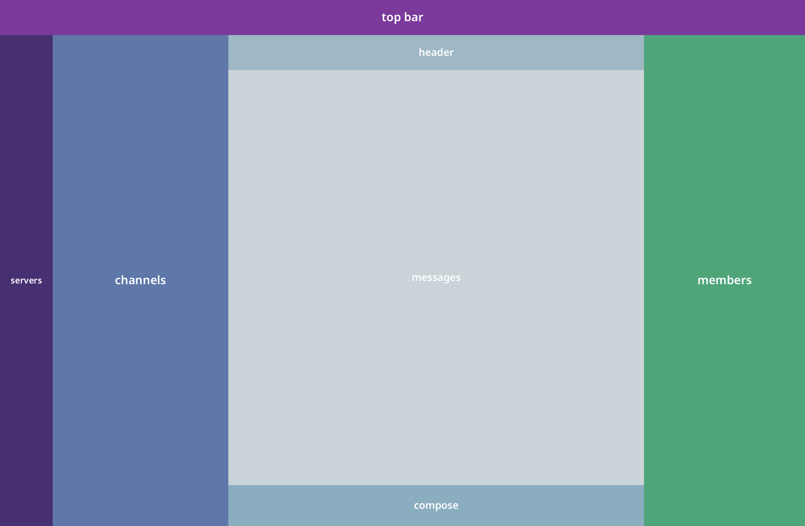

**Full source:** [`step06/main.go`](../demos/layout-shell/step06/main.go)

```diff
-	Container(Attrs(Expand, FixHeight(48), Background(280, 45, 42, 1), Center), func() {
-		// (empty or unlabeled in earlier variants)
-	})
+	Container(Attrs(Expand, FixHeight(48), Background(280, 45, 42, 1), Center), func() {
+		Label("top bar", FontSize(16), FontWeight(WeightSemibold), TextColor(0, 0, 100, 1))
+	})
```

**What to notice:** If your step 05 already labeled everything, this step is a
checkpoint — the screenshot is the map of the shell.

---

## Step 07 — Server icons

Fill the rail with dummy servers; main slots stay placeholders.

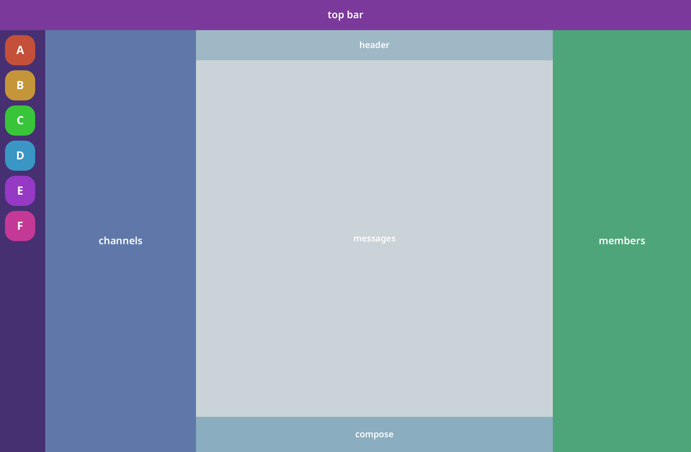

**Full source:** [`step07/main.go`](../demos/layout-shell/step07/main.go)

### Chunk 1 — Data

```diff
+var servers = []struct {
+	letter string
+	hue    float32
+}{
+	{"A", 10}, {"B", 40}, {"C", 120}, {"D", 200}, {"E", 280}, {"F", 320},
+}
```

### Chunk 2 — Rail becomes a column of tiles

```diff
-		Container(Attrs(FixWidth(72), Expand, Background(260, 40, 32, 1), Center, Pad(4)), func() {
-			Label("servers", ...)
-		})
+		Container(Attrs(FixWidth(72), Expand, Background(260, 40, 32, 1), Pad(8), Gap(8)), func() {
+			for _, s := range servers {
+				Container(Attrs(FixSize(48, 48), Corners(16), Background(s.hue, 55, 50, 1), Center), func() {
+					Label(s.letter, FontSize(18), FontWeight(WeightBold), TextColor(0, 0, 100, 1))
+				})
+			}
+		})
```

**What to notice:** Filling a pane does not change the outer shell. Header /
messages / compose placeholders remain.

---

## Step 08 — Channel list

Fill channels with a short scrollable list.

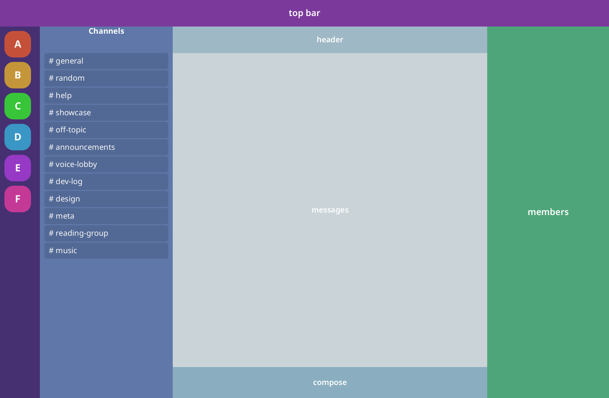

**Full source:** [`step08/main.go`](../demos/layout-shell/step08/main.go)

### Chunk 1 — Data

```diff
+var channels = []string{
+	"general", "random", "help", /* ... */,
+}
```

### Chunk 2 — Channels column: header + scroll body

```diff
-			Container(Attrs(FixWidth(240), Expand, Background(...), Center), func() {
-				Label("channels", ...)
-			})
+			Container(Attrs(FixWidth(240), Expand, Background(220, 30, 52, 1)), func() {
+				Container(Attrs(Expand, FixHeight(44), Pad2(0, 12), CrossMid), func() {
+					Label("Channels", FontSize(14), FontWeight(WeightBold), TextColor(0, 0, 100, 1))
+				})
+				// Grow+Clip+Scroll — fine for a *short* list.
+				Container(Attrs(Grow(1), Expand, Clip, Pad2(4, 8), Gap(2)), func() {
+					ScrollOnInput()
+					for _, name := range channels {
+						Container(Attrs(Expand, Pad2(6, 8), Corners(4), Background(0, 0, 0, 0.12)), func() {
+							Label("# "+name, FontSize(14), TextColor(0, 0, 98, 1))
+						})
+					}
+				})
+			})
```

**What to notice:** Twelve channels fit. The same `Grow`+`Clip` recipe will
fail when the middle list is taller than its budget — next step.

---

## Step 09 — Compose bug (intentional)

Fill **messages** with a long list using only `Grow`+`Expand`+`Clip`. Watch the
compose strip.

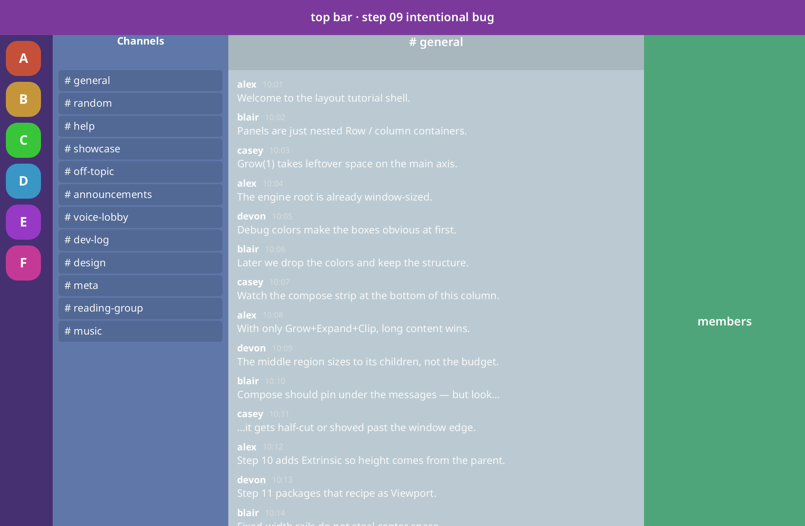

**Full source:** [`step09/main.go`](../demos/layout-shell/step09/main.go)

### Chunk 1 — Widgets import + draft buffer + message data

```diff
 import (
 	...
 	. "go.hasen.dev/shirei"
+	. "go.hasen.dev/shirei/widgets"
 )
+
+var messages = []msg{ /* ~15 lines of dummy chat */ }
+var draft string
```

### Chunk 2 — Messages pane: the **wrong** recipe

```diff
-				Container(Attrs(Grow(1), Expand, Background(200, 15, 82, 1), Center), func() {
-					Label("messages", ...)
-				})
-				Container(Attrs(Expand, FixHeight(56), Background(200, 30, 65, 1), Center), func() {
-					Label("compose", ...)
-				})
+				// WRONG on purpose: Grow+Expand+Clip without Extrinsic.
+				Container(Attrs(Grow(1), Expand, Clip, Pad(12), Gap(10)), func() {
+					ScrollOnInput()
+					for _, m := range messages {
+						// author / time / body labels...
+					}
+				})
+				Container(Attrs(Expand, Pad(10), Gap(8), Row, CrossMid, Background(0, 0, 0, 0.12)), func() {
+					a := DefaultTextInputAttrs()
+					a.NoAutoFocus = true
+					TextInputExt(&draft, a)
+					Button(NoIcon, "Send")
+				})
```

**What to notice:** Compose is **half-cut or gone**. Without **`Extrinsic`**,
the middle still measures from its children, so the whole main column grows
past the window. `Grow` alone does not mean “take remaining budget only.”

---

## Step 10 — Fix with Extrinsic

Same layout; pin the message region’s height to the parent budget.

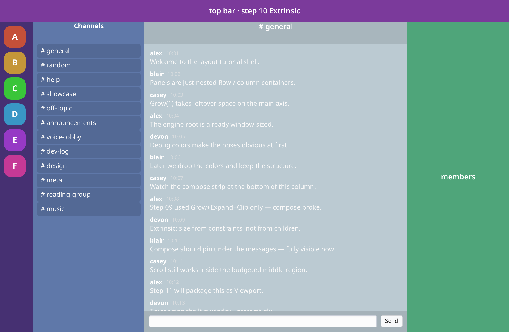

**Full source:** [`step10/main.go`](../demos/layout-shell/step10/main.go)

One decisive change in the messages container:

```diff
-				Container(Attrs(Grow(1), Expand, Clip, Pad(12), Gap(10)), func() {
+				// FIX: Extrinsic — middle height from parent, not message count.
+				Container(Attrs(Grow(1), Expand, Clip, Extrinsic, Pad(12), Gap(10)), func() {
 					ScrollOnInput()
 					for _, m := range messages {
```

(Optional: apply `Extrinsic` on the channel list the same way for consistency.)

**What to notice:** Compose is fully visible. Scroll still works inside the
budgeted middle. **`Extrinsic`** = size from constraints, not from content.

---

## Step 11 — Viewport helper

Package the step-10 recipe as `Viewport`.

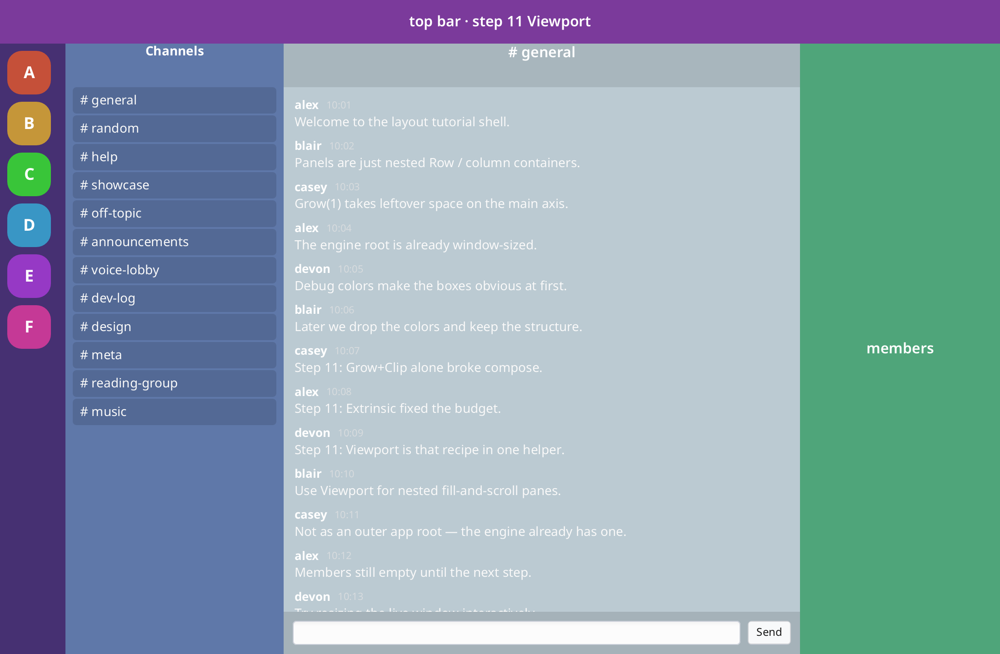

**Full source:** [`step11/main.go`](../demos/layout-shell/step11/main.go)

```diff
-				Container(Attrs(Grow(1), Expand, Clip, Extrinsic, Pad(12), Gap(10)), func() {
+				// Viewport = Clip + Extrinsic + Expand + Grow(1) + NoAnimate
+				Container(Attrs(Viewport, Pad(12), Gap(10)), func() {
```

Same substitution for any other scroll pane you already fixed with Extrinsic
(e.g. channels).

**What to notice:** `Viewport` is for **nested** fill-and-scroll regions
(message lists, sidebars) — not an outer app root. That is why it exists.

---

## Step 12 — Members list

Fill the right rail with the same Viewport pattern.


**Full source:** [`step12/main.go`](../demos/layout-shell/step12/main.go)

### Chunk 1 — Data

```diff
+var members = []struct {
+	name string
+	hue  float32
+}{
+	{"alex", 10}, {"blair", 40}, /* ... */,
+}
```

### Chunk 2 — Members column

```diff
-			Container(Attrs(FixWidth(220), Expand, Background(...), Center), func() {
-				Label("members", ...)
-			})
+			Container(Attrs(FixWidth(220), Expand, Background(150, 35, 48, 1)), func() {
+				Container(Attrs(Expand, FixHeight(44), Pad2(0, 12), CrossMid), func() {
+					Label("Members — online", ...)
+				})
+				Container(Attrs(Viewport, Pad2(6, 10), Gap(6)), func() {
+					ScrollOnInput()
+					for _, m := range members {
+						// avatar circle + name
+					}
+				})
+			})
```

**What to notice:** Same recipe as channels/messages. Short lists can stay a
plain loop inside `Viewport`.

---

## Step 13 — Polish (light)

Same structure; light chrome so standard widgets read cleanly.

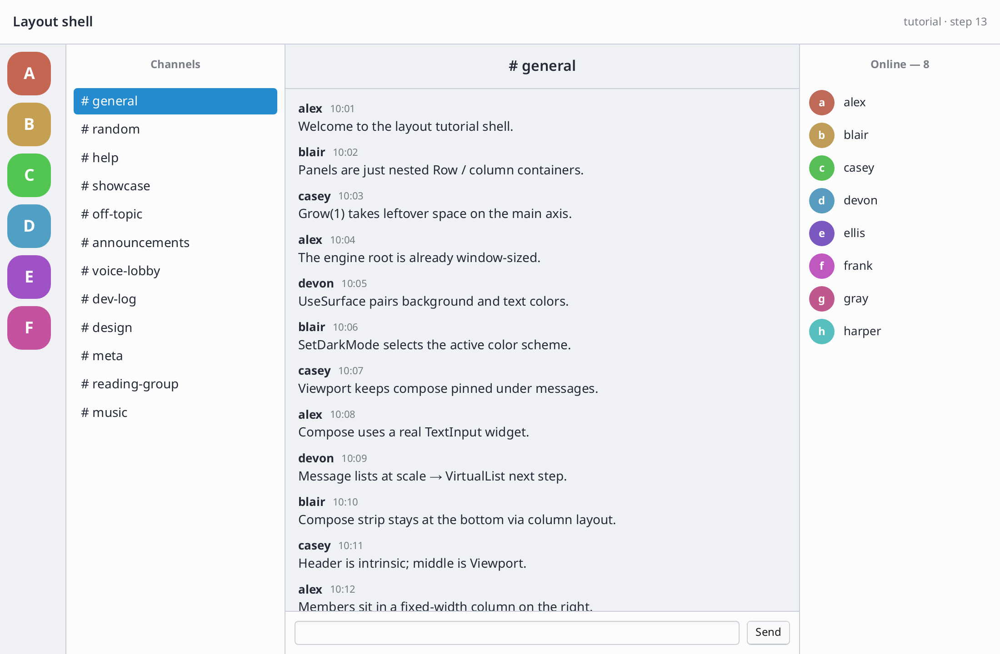

**Full source:** [`step13/main.go`](../demos/layout-shell/step13/main.go)

### Chunk 1 — Palette + root background

```diff
 func frame() {
+	const (
+		bgMain, bgSide, bgRail float32 = 97, 94, 92
+		textPrim, textMuted    float32 = 18, 45
+		borderA                float32 = 0.08
+	)
+	ModAttrs(Background(220, 6, bgMain, 1))
```

### Chunk 2 — Restyle each pane

Swap loud debug `Background(...)` for light greys, dark text, hairline
separators (`Element` 1px). Selection tint on `# general` stays subtle.

Structure (rows/columns/`Viewport`/compose) is **unchanged** — only colors and
labels like `"Layout shell"`.

**What to notice:** Compose remains a real `TextInput` that **grows** in the
row by default (`FixedWidth` would pin a chip-sized field).

---

## Step 14 — VirtualList for scale

Same light shell; messages and members use `VirtualListView` so hundreds of
rows stay cheap.


**Full source:** [`step14/main.go`](../demos/layout-shell/step14/main.go)

### Chunk 1 — Scale the data + list keys

```diff
-var messages = []msg{ /* 15 hand-written rows */ }
-var members = []struct{ ... }{ /* 8 people */ }
+var (
+	messages   []msg
+	members    []member
+	msgList    = new(int) // VirtualList identity keys
+	memberList = new(int)
+)
+
+func init() {
+	// e.g. 800 messages, 250 members
+}
```

### Chunk 2 — Messages body: loop → VirtualList

```diff
-				Container(Attrs(Viewport, Pad(14), Gap(12)), func() {
-					ScrollOnInput()
-					for _, m := range messages {
-						// row UI...
-					}
-				})
+				Container(Attrs(Grow(1), Expand), func() {
+					VirtualListView(msgList, len(messages),
+						func(i int) any { return messages[i].id },
+						nil, // auto-height via Measure
+						func(i int, width f32) {
+							// same row UI as before, for messages[i]
+						},
+					)
+				})
```

### Chunk 3 — Members: same swap

```diff
-				Container(Attrs(Viewport, ...), func() {
-					ScrollOnInput()
-					for _, m := range members { ... }
-				})
+				Container(Attrs(Grow(1), Expand), func() {
+					VirtualListView(memberList, len(members),
+						func(i int) any { return members[i].id },
+						nil,
+						func(i int, width f32) { /* row UI */ },
+					)
+				})
```

Channels can stay a small `Viewport`+loop.

**What to notice:** Layout shell is unchanged. VirtualList only builds visible
rows; `ItemHeight` nil measures each row with `Measure`. Details:
[virtual-list.md](virtual-list.md).

---

## Recap

1. Outer shell (01–04), then **lock compose into the main column (05)**.
2. Fill content gradually (06–08).
3. **09 → 10 → 11:** broken compose → **`Extrinsic`** → **`Viewport`**.
4. Members, light polish, VirtualList at scale (14).

## Next: custom widgets

Layout ends at step 14. A **separate** tutorial teaches Shirei’s process vs
presentation model (custom button → custom field → compose bar), then product
polish (dark shell + optional scrollbar tint):

**[Custom widgets: process, paint, and a chat compose bar](custom-widgets-tutorial.md)**

Samples:
[`step15a`](../demos/layout-shell/step15a/) (custom send only),
[`step15`](../demos/layout-shell/step15/) (full compose),
[`step16`](../demos/layout-shell/step16/) (dark shell).

## Common mistakes

- Outer `Viewport` around the whole UI.
- Message list with only `Grow`+`Clip` (step 09).
- Forgetting `Grow` on the center column of a row shell.
- Plain loops for huge histories (step 14).

## Source map

| | |
|--|--|
| Steps | [`demos/layout-shell/stepNN/`](../demos/layout-shell/) (01–14) |
| Images | [`layout-tutorial/images/`](layout-tutorial/images/) |
| Regen | `demos/layout-shell/gen-pngs.sh` |
| Custom compose follow-up | [custom-widgets-tutorial.md](custom-widgets-tutorial.md) · [`step15/`](../demos/layout-shell/step15/) |
