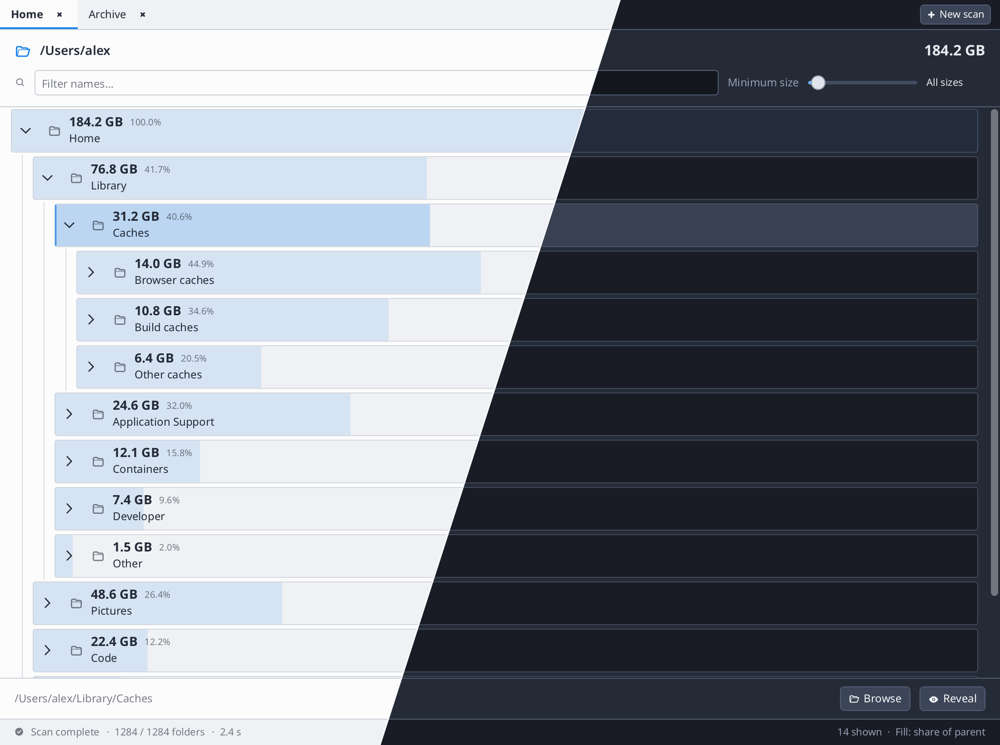

# dir_weight

Disk-usage explorer: scan a directory tree and find what is taking the space.



## Disk usage tree

Point it at a folder (or pick one from the candidate list). It scans in the
background with a small worker pool and builds a tree of entries as it goes.
Each row’s bar is that entry’s share of its *parent*, so the heaviest children
jump out without reading numbers.

- Expand a directory to drill in; collapse when you are done
- Min-size slider hides small noise; name filter flattens the tree and sorts by size
- Multiple scans as tabs (close a tab to stop its scan)
- **Browse** / **Reveal** open the path in the OS file manager
- Hard links counted once; slow network mounts get a progress feel without freezing the UI

## Proportion bar behind the row

Each row’s fill is that entry’s size divided by its parent’s size. The bar is
an `Element` positioned at `(0, 0)` of the row content box, sized to a fraction
of `GetResolvedSize()`, and painted *behind* the labels/buttons so normal flex
layout is unchanged.

```go
// main.go — viewEntry (simplified)
sizePercent := f32(entry.Size) / f32(parentSize)

Container(Attrs(Expand, Pad(4), Corners(2), Background(0, 0, 80, 0.5)), func() {
    size := GetResolvedSize()
    size[0] *= sizePercent
    Element(Attrs(Float(0, 0), FixSizeVec(size), Behind, Background(0, 0, 20, 0.5)))

    Container(Attrs(Expand, Row, CrossMid, Gap(10)), func() {
        Label(FmtBytes(entry.Size, entry.Size), FontWeight(WeightBold))
        // Browse / Reveal, path, …
    })
})
```

Because the bar uses `Behind`, it does not participate in row/column flex
sizing — it only paints under whatever content you put on top.

## Virtual list of a flattened tree

Expand/collapse does not nest virtual lists. Visible rows are collected into a
slice (`ListupViewableEntries`), then drawn with `VirtualListView` at a fixed
row height. Opening a folder only changes which entries appear in that slice.

## Background scan under the frame lock

Workers read the filesystem **off** the UI thread (`buildDirDraft`) into a
private list of children. They only attach that list, update counters, and
roll sizes under `WithFrameLock` (`publishDirDraft` →
`updateSizeAndStateAndSorting`). Closing a tab sets an atomic cancel flag so
in-flight jobs never promote the scanner to `Done`. Hard links use atomic
`LoadOrStore`; directory cycles are blocked via `seenDirs` + skipping
symlink-like modes.

## Run it

```shell
go run .                 # inside examples/dir_weight
go run . --png out.png   # headless frame (optional path arg)
```
