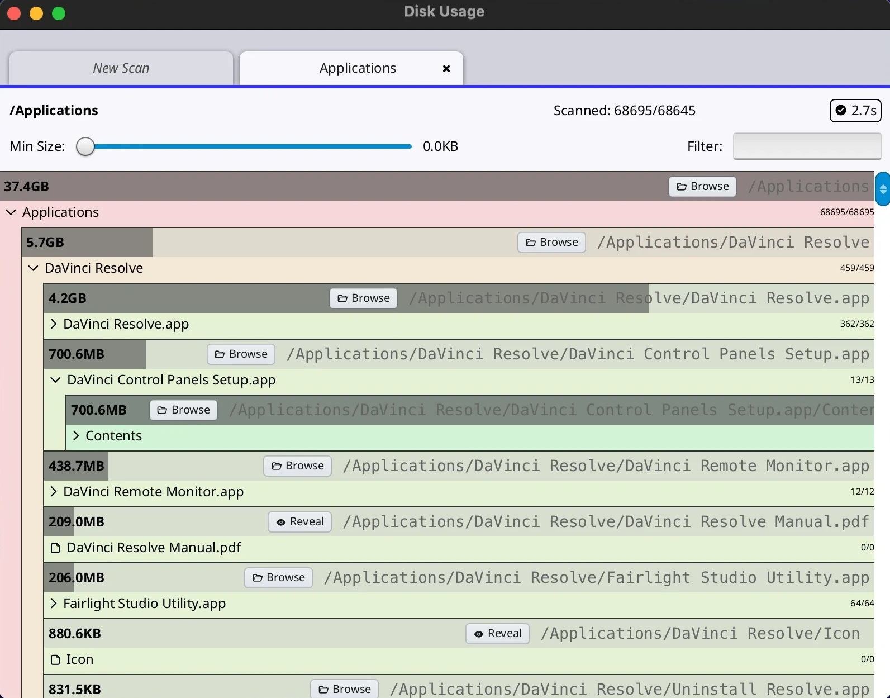

# du

Disk-usage explorer: scan a directory tree and find what is taking the space.



## What it does

Point it at a folder (or pick one from the candidate list). It scans in the
background with a small worker pool and builds a tree of entries as it goes.
Each row’s bar is that entry’s share of its *parent*, so the heaviest children
jump out without reading numbers.

- Expand a directory to drill in; collapse when you are done
- Min-size slider hides small noise; name filter flattens the tree and sorts by size
- Multiple scans as tabs (close a tab to stop its scan)
- **Browse** / **Reveal** open the path in the OS file manager
- Hard links counted once; slow network mounts get a progress feel without freezing the UI

## What it shows (shirei)

du is the oldest example here. It is a good place to see a “real” tool-shaped
layout: plain Go data, a virtualized list of many rows, and background work that
never blocks the frame.

### Plain state, rebuilt every frame

`ScanEntry` trees and a slice of scanners live in normal Go structs. `RootView`
just walks that state into containers — no widget objects to keep in sync.

See `main.go`: `ScanEntry`, `appData`, `RootView`.

### Background scan under the frame lock

Workers submit directory jobs, then publish results with `WithFrameLock` and
`RequestNextFrame`. The UI only reads the tree on the frame path. That is the
standard pattern for long-running work in shirei.

See `main.go`: `_runScanJob`, `updateSizeAndStateAndSorting`.

### Virtual list of a flattened tree

Visible rows are collected into a slice (`ListupViewableEntries`), then drawn
with `VirtualListView` at a fixed row height. Expand/collapse only changes which
rows are in that slice.

See `main.go`: `ScanResultPanel` / the virtual list setup near the result view.

### Proportion bar with `Float` + `Behind`

The size fill is not a special chart widget. It is an `Element` floated behind
the row content, sized as a fraction of the parent’s resolved width:

```go
// viewEntry — bar width = size / parent size
size := GetResolvedSize()
size[0] *= sizePercent
Element(Attrs(Float(0, 0), FixSizeVec(size), Behind, Background(0, 0, 20, 0.5)))
```

Useful whenever you want a progress/share bar inside a row without leaving flex
layout.

## Run it

```shell
go run .                 # inside examples/du
go run . --png out.png   # headless frame (optional path arg)
```
