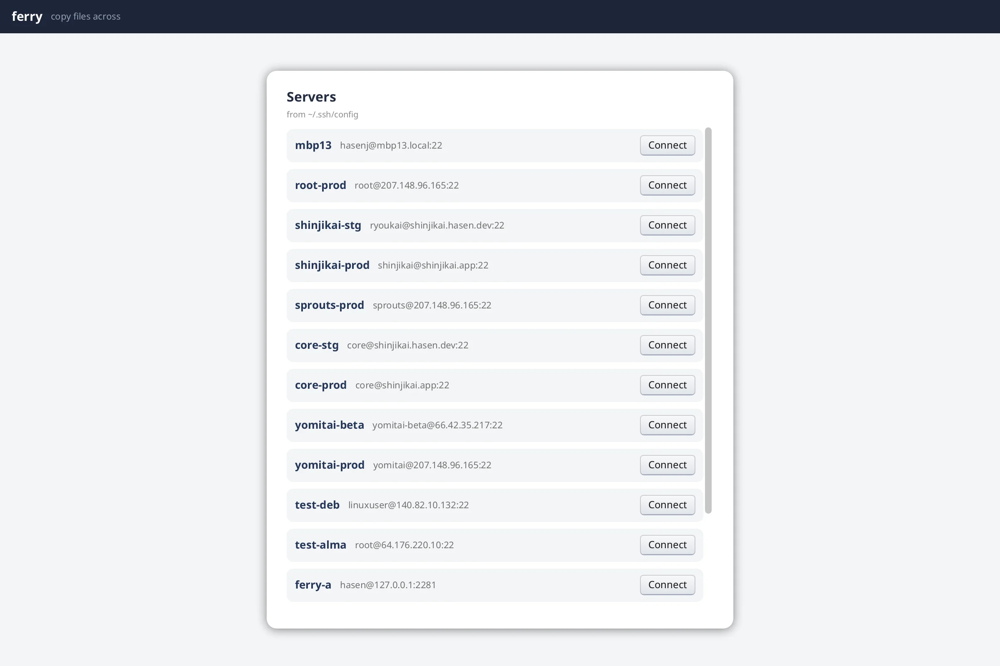

# ferry

Two-pane file manager for copying between your machine and servers over SSH/SFTP.



## SSH/SFTP file transfer and management

Lists hosts from your SSH config (`~/.ssh/config` by default; `-F` to override),
opens sessions as tabs, and shows a **local** pane beside a **remote** pane.
Multi-select files (click / cmd / shift, drag-select, arrows) and ferry them
either direction. Transfers run in a global queue with progress; when names
collide you pick skip, merge, replace, or overwrite.

Browsing and previews use SFTP. Bulk copies do not: they stream a gzip’d tar
over an SSH exec session into a stage directory next to the destination, then
commit with renames. If anything fails, the stage is deleted and the
destination is left as it was — nothing half-written shows up on the far side.

Deletion on the remote is two-phase on purpose (`rm` has no undo):

1. **Move to bin** — reversible staging; rows stay in the listing with a trash
   stamp so pending deletes stay visible
2. **Delete N permanently…** — red, confirm dialog with the full path list; no
   Enter shortcut

Closing a tab with a non-empty bin warns first. The bin is per session (prod-a’s
staged deletes never appear under prod-b); the local pane is shared across tabs;
the transfer strip is global but tags each job with its server.

Also:

- Sortable listings; show/hide hidden files
- Collapsible text/image preview (and collapsible transfer / bin strips so they
  can share the bottom of the window without fighting)
- Host-key accept and password prompts as modals; host-key *mismatch* is a hard
  error, not “trust anyway”
- New remote folder; reconnect banner if a session drops

CLI for the same transport without the GUI: `ferry hosts`, `ls`, `head`,
`put`, `get`.

## Modals as optional overlays

`RootView` always draws chrome. A modal appears only when the matching request
pointer is non-nil — opening/closing is just assigning that field (from a
background connect path under the frame lock, or from a button).

```go
// gui.go — RootView (end of frame)
if req := appData.hostKeyReq; req != nil {
    HostKeyModal(req)
}
if req := appData.passwordReq; req != nil {
    PasswordModal(req)
}
if req := appData.conflictReq; req != nil {
    ConflictModal(req)
}
// delete-confirm, leave-confirm, new-folder …
```

No modal stack type: presence of data is the open state.

## Collapsible panel with animated height

`CollapsiblePanel` keeps a fixed header and a body whose height is either 0 or
`BodyH`. The body is keyed separately (`id+"-body"`) so the height change
animates instead of the content thrashing identity. The chevron toggle lives in
its own hit zone so action buttons in the header cannot also toggle.

```go
// panels.go — CollapsiblePanel (simplified)
ContainerWithKey(s.Id, Attrs(Expand, BackgroundVec(s.Bg)), func() {
    // header: chevron + Title() in a PressAction zone; Actions() outside it
    h := f32(0)
    if *s.Open {
        h = s.BodyH
    }
    ContainerWithKey(s.Id+"-body", Attrs(Expand, FixHeight(h), Clip), func() {
        if h > 0 {
            s.Body()
        }
    })
})
```

Used for transfers, delete bin, and preview.

## Frame path only reads

Connect, list directory, transfer, and preview load run in goroutines and
publish under `WithFrameLock`. Directories show explicit loading states instead
of blocking the frame (`app.go`, `transfers.go`).

Mutators that shrink a list a view is walking (e.g. Restore from the delete bin)
build a new slice; the panel snapshots the header before ranging so the current
frame stays consistent (`deletebin.go` / `gui.go`).

## Where state lives

| State | Scope |
|-------|--------|
| Local pane | Shared across tabs |
| Remote pane + delete bin | Per SSH session / tab |
| Transfer queue | Global (each job tagged with its server) |

## Run it

```shell
go run .                    # inside examples/ferry; uses ~/.ssh/config
go run . -F path/to/config
go run . --png out.png
go run . hosts              # CLI: hosts, ls, head, put, get
```

Tests and `dev_ssh_config` use throwaway hosts only — never point automated
runs at production machines. For local lima boxes: `-F ./dev_ssh_config`.
