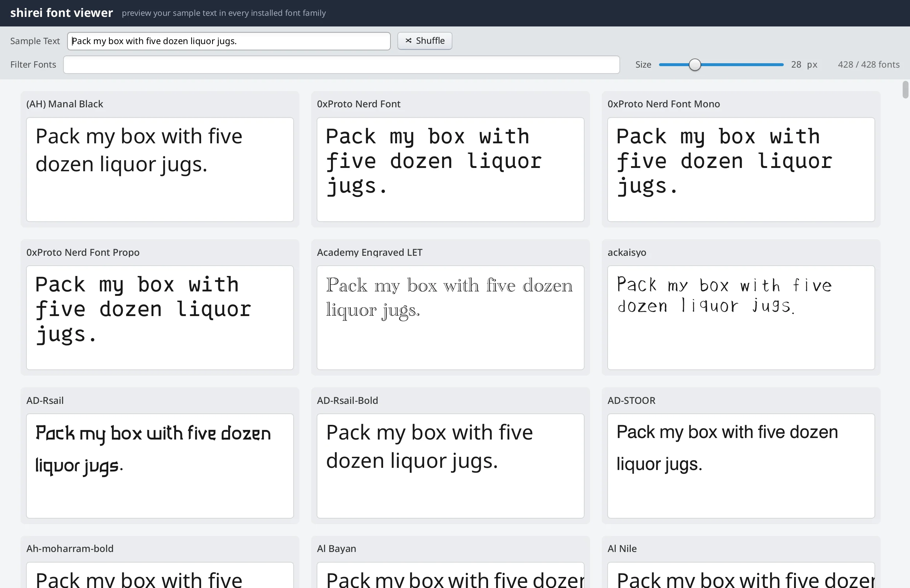

# fontviewer

Preview sample text in every font family shirei can find on the system.



## System font gallery

Type (or shuffle) sample text; every discovered family renders it on a card.
A filter box narrows by name, a slider sets preview size (12–72px), and
clicking a card copies the family name for use in `Fonts(...)` elsewhere.

Font files are prewarmed in the background so the grid stays scrollable while
hundreds of families load. Cards that are not ready yet show a skeleton instead
of blocking the frame on a synchronous parse.

## Per-label face with `Fonts`

The family *name* row uses the UI font. The sample text selects that family’s
face for one `Label` only — this is how app code picks a system font elsewhere
too:

```go
// main.go — FontCard
Label(fam.Name, FontSize(13), FontWeight(WeightMedium), TextColor(0, 0, 20, 1))

// sample in the family’s own face
Label(appData.sample,
    Fonts(fam.Name),
    FontSize(appData.fontSize),
    TextWidth(sampleTextWidth),
    TextColor(0, 0, 10, 1),
)
```

Until background prewarm has parsed the file, a skeleton stands in so scrolling
never blocks on a synchronous font open (`fontReady` / `SampleSkeleton`).

## Multi-column grid on a 1D virtual list

Column count comes from the panel’s resolved width. Frame 1 is often width 0;
request another frame and return. Each virtual “row” is a horizontal strip of
cards.

```go
// main.go — FontGrid (simplified)
width := GetResolvedSize()[0]
if width <= 0 {
    RequestNextFrame()
    return
}
cols := max(1, int((width+cardGap)/(cellWidth+cardGap)))
rows := (len(visible) + cols - 1) / cols

rowView := func(i int, w f32) {
    Container(Attrs(Row, Center, Expand, Gap(cardGap)), func() {
        start := i * cols
        for _, fam := range visible[start:min(start+cols, len(visible))] {
            FontCard(fam, ch)
        }
    })
}
VirtualListView(nil, rows, rowId, rowHeight, rowView)
```

Cards use `ContainerWithKey(fam, …)` so hover / “Copied” follow the family when
filtering reshuffles the grid.

## Headless vs interactive

Both paths wait briefly for the **background system font scan** so the grid is
the full install set (not only the small critical-path list loaded at startup).
`--png` skips background prewarm (parses on demand); the windowed path prewarms
in the background. Same `RootView`, two parse paths.

Cap the list for tests or quick captures:

```shell
go run . -limit-families=40
go run . -png out.png -limit-families=20
```

`-limit-families=0` (default) shows every discovered family.

## Run it

```shell
go run .                 # inside examples/fontviewer
go run . --png out.png   # legacy form still works
go run . -png out.png
```
