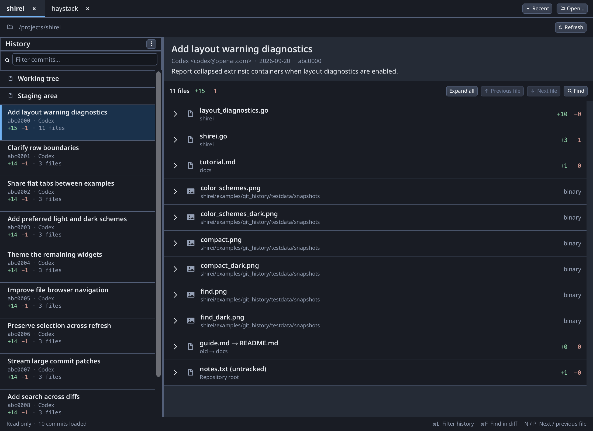

# git_history

Read-only git history and unified-diff viewer — a small native alternative to
flipping between `git log` and `git show`.


## What it does

- **Repository tabs:** Shared flat tabs, **Open…** for the folder browser,
  and a filterable **Recent** menu. Session restores open tabs on startup;
  history loads when a tab is selected. Close tabs with ×.
- **History:** Subject-first commit rows with the short hash underneath.
  The ⋮ menu adds author, timestamp, and lazy diff stats; these preferences
  persist per repository. History loads in pages as you scroll. **Working tree**
  and **Staging area** appear when changes are present.
- **History filter:** The visible field narrows commits by hash, subject, or
  author and highlights matches. **⌘/Ctrl+L** focuses it; × or **Escape** clears
  the query. Filtering keeps loading older pages while few matches are found.
- **Diff:** A compact commit header above a continuous, virtualized unified
  diff. Quiet addition/deletion backgrounds distinguish changes; file headers
  show the filename, parent directory, and change counts. Each collapsed file
  occupies one header row. Click anywhere on the header, or press **Enter/Space**
  when it is focused, to expand or collapse it. Drag diff text to select it;
  **⌘/Ctrl+C** copies the selection.
- **File toolbar:** File totals, **Collapse all / Expand all**, **Previous file**,
  **Next file**, and **Find**. **P/N** navigate files when no control has keyboard
  focus. Previous pins the last header above the viewport; next jumps past the
  last file in view, or to the end if no file remains.
- **Find:** **Find** or **⌘/Ctrl+F** replaces the file toolbar with a search field,
  match count, previous/next match arrows, and ×. The diff keeps the same space.
  **Enter / Shift+Enter** navigate matches while typing. **Escape** or × restores
  the file toolbar, preserving the query and current match for reopening.
  Search covers the whole diff and expands collapsed files containing a match.
- **Status:** A neutral bottom strip shows the loaded commit count, loading
  state, and shortcuts. The application follows the system light/dark preference.

Collapsed files show a compact overview of filenames, directories, and change counts:



Point it at a repo (cwd by default; walks up for `.git`):

```bash
go run .                 # GUI
go run . /path/to/repo
go run . --png out.png   # headless smoke frame
```

Refresh reloads the commit log. The work tree is also watched with
**fsnotify** (debounced): dirty slots update via pure-Go status when files or
the index change; the commit list reloads only when HEAD moves. Watches skip
`.git/objects`, ignored directories, and chmod-only noise. No stage/commit/push
— viewer only.

**Commit history / meta / patches** use **[go-git](https://github.com/go-git/go-git)**
and pure Go: log pages, `CommitObject`, then tree diff → short-locked blob
snapshots → per-file line diff streamed into the virtual list.

Dirty-slot **status**, **working-tree / staging diffs**, and **image wipe
blobs** are pure Go (status finds dirty paths; image sides come from
index/HEAD/commit trees via go-git, worktree files from disk). Sidebar commit
`+/−` stats still use `git log --numstat` in parallel workers. Diff docs are
cached after a full successful load; selection shows an instant stub, then meta
(commits) or progressive dirty files (worktree/stage), cancelable when you
change selection.
