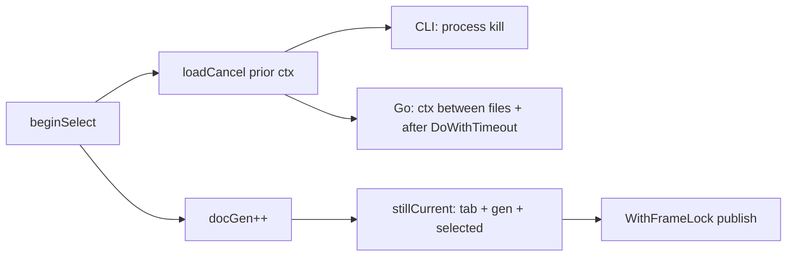

# Streaming Pure-Go Commit Patch Load for `git_history`

| Field | Value |
|-------|--------|
| **Author** | _(TBD)_ |
| **Date** | 2026-07-25 |
| **Status** | Draft (revised after re-review) |
| **Package** | `shirei/examples/git_history` |
| **Primary files** | `git.go`, `main.go`, `model.go`, `diffview.go`, `gui.go`, `find.go` |

---

## Overview

Selecting a commit today paints selection chrome instantly (stub + pure-Go meta) but still fills the unified diff in one shot via `git diff` / `git diff-tree -p` (`loadCommitPatchIntoCtx`). The old pure-Go path (`parent.Patch` → `Encode` → `parsePatch`) was abandoned because it held `lockRepo` for the entire line-diff and blocked other selection work.

This design restores a **pure-Go first-parent unified diff** for commits while making the result **feel instant** via **per-file streaming**: as soon as each changed file’s rows are ready, they append into the selected `DiffDoc.Rows` and the virtual list paints. File headers flush **before** that file’s Meyers line-diff so the user sees structure immediately; multi-file commits grow continuously as each file finishes. Repo lock use is restricted to short sections (tree walk, blob snapshot); line-diff runs **outside** the lock.

**Honest streaming bound:** go-git’s `utils/diff.Do` / `DoWithTimeout` compute the **entire** per-file line-diff before returning chunks — there is no progressive emission *during* Meyers. “Chunked flushes” of 64 rows are **post-diff UI batching** of an already-computed file, not concurrent production mid-LCS. Cancel between files is cooperative via `ctx`; mid-file cancel is a short `DoWithTimeout` (see Cancellation), not process-kill.

Working-tree / staging diffs remain CLI for this phase. Image wipe blob loads stay CLI-backed until a later pure-Go blob read (see Non-Goals).

---

## Background & Motivation

### Current split (post recent work)

| Path | Implementation | Notes |
|------|----------------|--------|
| History pages | `loadCommitPage` (go-git `Log`) | Holds `lockRepo` for page walk |
| Selection meta | `loadCommitMetaGo` | CommitObject only (~0.04 ms warm) |
| Dirty status | `computeRepoStatusPure` | Holds lock for status build |
| Instant select stub | `stubDocFromEntry` | Zero I/O; subject/author/time + sidebar stats |
| Sidebar +/− | `loadCommitStatsGo` / `snapshotFirstParentChanges` (pure Go) | Parallel workers; short lock + unlocked counts |
| Full commit patch | `loadCommitPatchIntoCtx` (CLI) | `git diff parent hash` or root `diff-tree -p` → `parsePatch` → `Segs` |
| Worktree / staging | CLI `git diff` / `diff --cached` | Plus untracked full-file adds |

### Selection load pipeline today (`runSelectionLoad`)

1. `beginSelect` → stub doc, `docGen++`, cancel prior load (package-level `loadCancel` — **process-wide**, all tabs).
2. Phase 1a: `loadCommitMetaGo`.
3. Phase 1b (if sidebar stats cold): **await** `loadCommitNumstatCtx` (~spawn-dominated ~13 ms) **before** phase 2.
4. Publish meta-only snapshot (`snap := *meta; t.doc = &snap`), `docLoading=true`.
5. Phase 2: `loadCommitPatchIntoCtx` → assign full `Rows`/`Segs` on private `meta`, then `t.doc = meta`, cache, `docLoading=false`.

UI already supports meta-before-patch: empty `Rows` while `docLoading` shows “Loading diff…”; once rows exist the virtual list paints.

**Bug relative to feel-instant:** cold numstat serializes on the critical path before any patch work. This design **removes that wait** (see Feel-instant pipeline).

### Why full go-git Patch was bad

- `commitPatch` → `parent.Patch(c)` + `fillDocFromPatch` (`Patch.Encode` + `parsePatch`) held `lockRepo` for the **entire** multi-file line-diff (`load_bench_test.go`, `BenchmarkCommitPatchGoGit`).
- Single-flight selection: a huge prior patch delayed the next selection even after cancel (CLI is killable via `CommandContext`; pure-Go was not interruptible mid-`Patch`).
- Line stats from go-git `Patch.Stats()` can diverge slightly from `git log --numstat` (rename/rewrite scoring).

### Measured baselines (warm M2, this monorepo)

| Operation | Wall time (order) |
|-----------|-------------------|
| Meta `CommitObject` | ~0.04 ms |
| CLI numstat | ~13 ms (spawn dominated) |
| CLI patch HEAD | ~11 ms |
| go-git full `Patch` (large Joyo-class commit) | ~27 ms warm; much worse cold / under lock contention |

Small commits are already “fast enough” via CLI. The product goal is **feel-instant** on multi-file large commits and **no lock starvation** when the user hammers selection — not beating CLI on tiny diffs, and not claiming mid-Meyers progressive lines.

### Product quote

> It does not have to *be* instant. It has to *feel* instant. Stream the diff rows as you go … as long as the user does not wait to see results on the screen, then it feels instant.

---

## Goals & Non-Goals

### Goals

1. **Pure-Go commit patch path** for first-parent (and root) unified diffs — no `git` subprocess on the happy path for commit **patch text**.
2. **Per-file streaming publish** of `DiffRow`s into the selected `DiffDoc`: file headers ASAP; each file’s body after that file’s line-diff completes (with post-diff UI batching for large row lists).
3. **Cancel / abandon** prior patch work when `docGen` changes or context is canceled (cooperative pure-Go cancel — not process-kill). Abandoned streamers may still finish an in-flight `DoWithTimeout` (up to ~2 s of CPU each); rapid re-select can pile several such finishes — better than unbounded full-commit Patch, not “at most one” globally.
4. **Short `lockRepo` sections**: never hold the per-path mutex across Meyers diffs; any `Tree`/`File`/storer use only under the lock. Line-diff always runs on **owned `[]byte`** via `diff.DoWithTimeout` (never via go-git `Change.PatchContext`, which calls `diff.Do` with a 1 h default under storer access).
5. **Preserve existing UI contracts**: stub → meta → rows; collapse (`DiffView` + `collapsedByDoc`); find; N/P file nav; image rows; doc cache for **completed** docs only.
6. **Progressive Segs/DiffView as a streaming correctness requirement** (not optional polish) whenever rows append mid-load.
7. **Optional CLI fallback** with defined reset-after-partial rules until confidence is high.
8. Document a **lock protocol** coexisting with history pages, status, and future pure-Go stats.
9. **Never await numstat** before starting the patch streamer.

### Non-Goals (this design / phase 1)

- Pure-Go working tree or staging diffs (recommend **phase 2**).
- Matching `git` numstat / rename scores **bit-exactly** (prefer exact rename detection; keep CLI numstat for sidebar).
- Progressive emission of lines **during** a single Meyers LCS (sergi/`utils/diff` does not support it; v1 does not invent a line-windowed algorithm).
- Multi-parent combined diffs (continue first-parent only).
- Persisting collapse state across app restarts (session-only already).
- Removing the git binary dependency entirely (worktree still CLI; **image wipe for commits still uses `gitBlob` / `git rev-parse` in `image_diff.go`** — pure-Go patch only produces `RowImage` markers; decode path is a later pure-Go blob read).
- Fixing process-wide `loadCancel` multi-tab cancel coupling (pre-existing; optional follow-up).

---

## Proposed Design

### Architecture

```mermaid
sequenceDiagram
    participant UI as UI frame<br/>(beginSelect / DiffStream)
    participant Load as runSelectionLoad
    participant Gate as lockRepo(path)
    participant Diff as pureGoPatchStreamer
    participant Num as numstat (optional)
    participant Doc as live DiffDoc

    UI->>UI: stubDocFromEntry; docGen++
    UI->>Load: requestLoad(ctx, gen)
    Load->>Gate: CommitObject (meta)
    Gate-->>Load: meta
    Load->>UI: publish live meta (docLoading=true)
    par Patch stream (no numstat wait)
        Load->>Diff: streamCommitPatchGo(ctx, live)
        loop each changed file
            Diff->>Gate: lock: Files()+blob snapshot
            Gate-->>Diff: owned []byte
            Diff->>UI: flush file header
            Note over Diff: DoWithTimeout OUTSIDE lock
            Diff->>Doc: append body batches + Grow segs
            Diff->>UI: RequestNextFrame
        end
    and Numstat if sidebar cold
        Load->>Num: loadCommitNumstatCtx
        Num-->>UI: fill live.Stats when ready
    end
    Load->>UI: docLoading=false; docCache.put(live)
```

### High-level pipeline (replaces phase 2 CLI)

**Phase 0–1a unchanged** (stub, meta). **Phase 1b numstat does not gate phase 2.**

```
// After meta publish onto live *DiffDoc:
go optionalNumstatInto(live)   // only if sidebar stats missing; never blocks streamer
streamCommitPatchGo(ctx, repoPath, hash, parents, live, publish)
```

**Stages inside the streamer:**

| Stage | Lock? | Work | Publish |
|-------|-------|------|---------|
| **A. Resolve trees** | Yes (short) | `CommitObject`, first parent (or empty tree), `Tree()` | — |
| **B. Tree diff** | Yes | `object.DiffTreeWithOptions(ctx, from, to, opts)` → `object.Changes`. Merkletrie walk is ctx-cancelable; **`DetectRenames` is not** (runs without context — exact-only keeps this short) | — |
| **C. Per change snapshot** | Yes (**re-lock per file**) | `Change.Files()` + blob bytes / binary flag into **owned** `[]byte`; copy paths, modes | **File header** flush before stage D |
| **D. Line-diff** | **No** | On owned strings: `diff.DoWithTimeout(from, to, perFileDiffTimeout)` → format unified text for that file → `parsePatch` → body rows | Append body (post-diff batching 64 rows / 8 ms); check `ctx` after |
| **E. Finalize** | No | Final segs consistency | `docLoading=false`; cache on success only |

Stage B rename policy: **exact renames only** (`OnlyExactRenames: true`) in v1. Content renames can read many blobs under lock in go-git’s `DetectRenames` and are not ctx-killable.

### Pure-Go patch generation (per-file, not giant Encode)

Do **not** call `parent.Patch(c)` / `Tree.Patch` / full-commit `Patch.Encode` on the hot path.

**Do not call `Change.PatchContext` / `Change.Patch` either.** go-git’s `filePatchWithContext` (v5.19.1) does `Files()` + `fileContent` (storer I/O) then **`diff.Do` (1 h default)**. Using it would force either (a) holding `lockRepo` across Meyers or (b) racing the storer, and would **not** honor `perFileDiffTimeout = 2s`.

#### Normative v1 pipeline (single path)

```
lock: Files() + copy bytes (cap) + path/mode meta
unlock
publish: RowFileHeader
unlocked: DoWithTimeout(2s) on owned strings
unlocked: format single-file unified-diff text (or DiffRows)
unlocked: parsePatch(text) for body rows  // reuses existing parser
publish: body batches
```

```go
// Pseudocode — patch_go.go (normative)
// INVARIANT: Change embeds *Tree; Files()/Contents/IsBinary MUST run under lockRepo.
// Only owned []byte and pure computation may run unlocked.
// FORBIDDEN on hot path: Change.Patch / PatchContext / parent.Patch / Tree.Patch.

r, unlock, err := lockRepo(repoPath)
// A+B under one or two lock sections...
changes, err := object.DiffTreeWithOptions(ctx, fromTree, toTree, &object.DiffTreeOptions{
    DetectRenames:    true,
    OnlyExactRenames: true, // v1
    RenameScore:      60,
})
unlock()

for _, ch := range changes {
    if ctx.Err() != nil { return ctx.Err() }

    r, unlock, err = lockRepo(repoPath)
    fromFile, toFile, err := ch.Files() // under lock
    fromBytes, fromBin := readFileSnapshot(fromFile) // owned copy, cap commitPatchMaxBytes
    toBytes, toBin := readFileSnapshot(toFile)
    label := changePathLabel(ch) // "path" or "old → new"
    modeOnly := isModeOnlyChange(ch, fromBytes, toBytes)
    unlock()

    // Header before expensive DoWithTimeout:
    if !publish([]DiffRow{{Kind: RowFileHeader, Text: label}}, false) {
        return nil // not current
    }
    if ctx.Err() != nil { return ctx.Err() } // re-check before stage D

    // Unlocked pure compute only — never PatchContext:
    body := rowsFromSnapshots(label, fromBytes, toBytes, fromBin, toBin, modeOnly)
    // rowsFromSnapshots:
    //   binary/image/mode-only → meta/image rows (no Do)
    //   text → diffs := diff.DoWithTimeout(string(from), string(to), perFileDiffTimeout)
    //        → unifiedText := formatUnifiedFile(label, diffs, ...)  // minimal a/ b/ headers + hunks
    //        → parsePatch(unifiedText), drop leading RowFileHeader if present
    //   on timeout: RowMeta truncate + optional bulk +/- remainder

    for each batch of body {
        if !publish(batch, false) { return nil }
    }
}
publish(nil, true) // done
```

#### Row emission strategy (v1 — locked)

| Step | Implementation |
|------|----------------|
| Snapshot | Under lock: `Files` + owned bytes |
| Header | Explicit `RowFileHeader` before line-diff |
| Line-diff | **`github.com/go-git/go-git/v5/utils/diff`.DoWithTimeout(..., 2s)** only |
| Rows | **`parsePatch` on single-file unified text** built from sergi chunks (reuses rename/binary/hunk paint rules). Helper `formatUnifiedFile` is small and ours — not go-git `Patch.Encode`. |
| Forbidden | `Change.PatchContext`, full-commit `Patch`, `diff.Do` without timeout |

Optional later: emit `DiffRow`s directly from chunks (skip string round-trip) once fixtures pass — same lock/timeout rules.

#### Rules `parsePatch` / row builder must preserve

| Case | Behavior |
|------|----------|
| Rename | Header text `old → new` (U+2192 arrow with spaces) so `statForHeader` / `headerStatCandidates` match |
| Binary non-image | `RowMeta` binary notice after header |
| Binary image (`isImagePath`) | `RowImage` with path (paint still loads blobs via existing CLI `gitBlob`) |
| Empty file add | Header + hunk `@@ -0,0 +1,0 @@` or single empty add per git/go-git output; parsePatch must not panic |
| Empty file delete | Symmetric |
| Mode-only change | Header + short `RowMeta` (“mode change”) if no content delta; skip empty noise |
| Submodule / symlink (`Files()` nil) | Skip or single `RowMeta`; do not call content diff |
| `\ No newline at end of file` | `RowMeta` as parsePatch does |
| Text content | `RowHunkHeader` + `RowAdd`/`RowDel`/`RowContext` with leading `+`/`-`/` ` |

**Fixture matrix (PR 1 tests):** add, delete, modify, rename (exact), binary, image path, root commit (empty parent tree), empty file add, mode-only if reproducible, multi-file commit for stream order.

#### Size caps

```go
// commitPatchMaxBytes caps each side of a text/binary snapshot for the streamer.
// Intentionally larger than untrackedMaxBytes (256 KiB): commit objects are already
// in the ODB and users expect full file diffs for normal sources; untracked is a
// best-effort worktree preview. CLI commit patch today is unbounded — this cap is
// a pure-Go safety rail, not a parity requirement.
const commitPatchMaxBytes = 2 << 20 // 2 MiB per side
```

On truncate: emit `RowMeta` analogous to untracked truncation  
(`… truncated (showing first N bytes of M)`). Image **display** still uses `maxImageBlobBytes` (12 MiB) on the separate wipe load path.

### Streaming architecture (worker → UI)

#### DiffDoc pointer lifecycle (mandatory)

Today’s meta/snap split is **forbidden** on the streaming path. Single protocol:

1. **Stub:** `beginSelect` sets `t.doc = stubDocFromEntry(...)` (may be replaced immediately).
2. **Live meta:** after `loadCommitMetaGo`, set `live := meta` (the `*DiffDoc` from meta — one allocation). Under frame lock: `t.doc = live`, `t.docID = entry.ID`, `docLoading = true`. Do **not** `snap := *meta`.
3. **Append-only stream:** streamer receives `live` and **only** mutates it under `WithFrameLock` via `publish` (append `Rows`, update `Segs`/`DiffView`, optional late `Stats` from parallel numstat).
4. **Complete:** under frame lock: `docLoading = false`, `docCache.put(entry.ID, live)` — **same pointer**.
5. **Gen advanced / abandon:** stop publishing; do not cache; leave whatever `t.doc` the new selection installed.
6. **Hard error:** see Failure & fallback (never cache partial success).

`DiffDoc.Segs` contract update: built/updated **during** load as rows grow; final after `docLoading == false`.  
`DiffView` contract update: source `Rows` are **append-only during load**, immutable after complete (indices stable; comment in `diffview.go` should change from “Rows stay immutable” to that).

#### Publish batching

```go
const (
    streamFlushRows  = 64
    streamFlushEvery = 8 * time.Millisecond
    perFileDiffTimeout = 2 * time.Second // DoWithTimeout; Key Decision
)
```

Protocol:

1. After stage C: flush **file header** as its own batch (before `DoWithTimeout`).
2. After stage D returns full body rows: flush in batches of `streamFlushRows` or every `streamFlushEvery` — **UI batching of completed work**, not mid-Meyers streaming.
3. Each flush: `WithFrameLock` → if still current → append + **bootstrap or Grow segs** (below) → `RequestNextFrame()`.
4. Never hold frame lock during line-diff or `lockRepo`.

#### Virtual list / scroll stability

- Dynamic `ItemCount` from `len(doc.Rows)` or `DiffView.ItemCount()`.
- Append-only: source indices and `ItemKey` stable for existing rows.
- Progressive segs keep prefix sums correct (required — see next section).

### Progressive `Segs` and `DiffView` (correctness, not polish)

`syncDiffView` today returns the existing view when `docID` matches and **never** rebuilds segs. Streaming without updating the live `DiffView` leaves `ItemCount` / collapse / N/P **stale** after the second flush.

**Requirement:** every successful row append that changes file spans must update segs **and** the live `DiffView` under the same frame lock. This is part of PR 2, not deferred polish.

| Concern | Approach |
|---------|----------|
| Open file’s `End` | Incremental: last seg `End = len(Rows)` |
| New file header | Append `DiffFileSeg`; apply `collapsedByDoc[path]` if remembered |
| Stats on header | Prefer `doc.Stats` / numstat when present; else `countSegStats` on partial body |
| Collapse mid-stream | Same `DiffView` instance; path-stable collapsed flags |
| Full rescan | **Avoid** `buildDiffFileSegs` every flush under frame lock (O(total rows)) |

**Preferred under lock (O(1) / O(files) after bootstrap):**

```go
// Grow applies an append-only Rows growth from prevRowCount → len(doc.Rows):
//   - If v has no segs yet: scan Rows[0:len) (or [prev:len) when prev==0 and
//     this is the first append) for RowFileHeader boundaries; init segs +
//     collapsed from remembered paths; rebuildPrefix.
//   - Else: extend last seg.End to len(Rows); if a new RowFileHeader appears
//     in [prev,len), close previous End and append a new DiffFileSeg.
// Preserves collapsed[] by path for existing segs; new paths default expanded
// unless remembered in collapsedByDoc.
func (v *DiffView) Grow(doc *DiffDoc, prevRowCount int, remembered map[string]bool)

// ReplaceSegsPreservingCollapse: complete or recovery only (not every flush).
func (v *DiffView) ReplaceSegsPreservingCollapse(segs []DiffFileSeg)
```

#### Bootstrap rules (when `diffView` is nil)

Until the first `DiffStream` paint, `t.diffView` may be nil. Publish must still keep **`live.Segs` coherent** so the first `syncDiffView` is correct:

1. On every successful append under frame lock:
   - `prev := len(live.Rows)`; append batch; `newLen := len(live.Rows)`.
   - If `t.diffView != nil && t.diffView.docID == entry.ID`: `t.diffView.Grow(live, prev, remembered)`; then **`live.Segs = cloneSegs(t.diffView.segs)`** (or share if immutable after grow).
   - Else if `t.diffView == nil` or wrong docID: maintain segs on the doc only — either
     - `growDocSegs(&live.Segs, live.Rows, prev, newLen, stats)` (same header/End rules as Grow, no collapse flags), or
     - on first append with empty `live.Segs`, `live.Segs = buildDiffFileSegs(live)` once then incremental growDocSegs thereafter.
2. `syncDiffView`: if `diffView == nil` or `docID` mismatch → `newDiffView(docID, live.Segs)` then `ApplyCollapsedPaths(collapsedByDoc[docID])`. If view exists but last seg `End != len(Rows)` or `len(segs)` lags headers → `Grow(live, lastKnown, …)` then mirror segs back to `live.Segs`.
3. **Unit test (PR 2):** append header+body batches with `diffView == nil`, assert `live.Segs` ItemCount-equivalent spans; then `syncDiffView` yields `HasSegs()` and matching `ItemCount()`.

Streamer publish sketch:

```go
prev := len(live.Rows)
live.Rows = append(live.Rows, batch...)
remembered := t.collapsedByDoc[entry.ID]
if t.diffView != nil && t.diffView.docID == entry.ID {
    t.diffView.Grow(live, prev, remembered)
    live.Segs = cloneSegs(t.diffView) // keep doc.Segs == view segs
} else {
    growDocSegs(&live.Segs, live.Rows, prev, len(live.Rows), live.Stats)
}
```

On complete: optional full `buildDiffFileSegs` + `ReplaceSegsPreservingCollapse` once for stats cleanup.

### Feel-instant pipeline (budgets)

| Milestone | Target | Mechanism |
|-----------|--------|-----------|
| Selection chrome | Same frame | `stubDocFromEntry` |
| Body / email / parents | ≲ 1–2 ms after select | `loadCommitMetaGo` |
| Start patch stream | Immediately after meta publish | **Do not await numstat** |
| First file header | After tree diff + first file snapshot (not after numstat) | Stage B+C; flush header before `DoWithTimeout` |
| First file body lines | After that file’s `DoWithTimeout` returns | Post-diff batching |
| Subsequent files | After each file completes | Per-file stream |
| Huge single-file rewrite | Bound by `perFileDiffTimeout` (2 s) then truncated/bulk remainder | Cooperative cancel path |
| Full multi-file commit | Unbounded but cancelable between files | Continuous growth |

Parallel numstat (if needed) may fill `live.Stats` / totals under frame lock **without** blocking headers.

### Cancellation

Pure-Go cancel is **cooperative**, not equivalent to CLI `CommandContext` kill.



Rules:

1. Check `ctx.Err()` between files, before/after each lock section, **before stage D**, and after every publish batch.
2. **Mandate** `diff.DoWithTimeout(src, dst, perFileDiffTimeout)` with `perFileDiffTimeout = 2s` on **owned strings only** (never go-git `PatchContext` → internal `diff.Do` / 1 h). On timeout: emit `RowMeta` truncated notice and/or bulk remaining lines as add+del without full LCS; then continue to next file if still current.
3. `stillCurrent()` before every publish; abandoned gens must not publish.
4. Never `docCache.put` on cancel.
5. Re-select same commit: restart clean (no resume).
6. **Gen advanced:** abandon silently (no error on old gen).
7. **Pre-existing:** package-level `loadCancel` is process-wide — selecting in tab B cancels tab A’s load. Out of scope to fix in phase 1; optional follow-up: per-`RepoTab` cancel.

**CPU pile-up (honest):** `DoWithTimeout` does not observe `ctx`. Rapid re-select can leave **multiple** abandoned streamers each finishing up to ~2 s of Meyers CPU, plus a new tree-diff under `lockRepo`. That is still bounded per abandoned file and vastly better than multi-file `Patch` under the gate. Goal 3 does **not** claim “at most one” global in-flight timeout. Optional later: single-flight worker queue; not phase 1.

### Failure & fallback after partial publish

| Situation | UI / doc state | Cache | Fallback |
|-----------|----------------|-------|----------|
| Hard error **before any row** | `docErr = err`, `docLoading=false`, `Rows` empty | No | Optional CLI from empty |
| Hard error **after some rows** | Clear `Rows`/`Segs` (and `diffView = nil` or Replace empty), **then** either show `docErr` **or** run CLI fallback | No until success | If fallback: **replace** rows under frame lock (never append CLI onto pure-Go partial) |
| `context.Canceled` / gen mismatch | Stop; no `docErr` for abandoned gen | No | No |
| CLI fallback success | Full rows/segs like today; `docLoading=false` | Yes | — |
| CLI fallback failure | `docErr`, empty or cleared rows | No | — |

Loader sequence after streamer returns (normative):

```go
// runSelectionLoad phase 2 tail — pure-Go then optional CLI.
err := streamCommitPatchGo(ctx, repo, entry.ID, live.Parents, live, publish)
if err == nil || errors.Is(err, context.Canceled) || ctx.Err() != nil {
    return // success path already set docLoading/cache inside publish(done);
           // cancel: publish stopped; do not touch cache
}
if !shouldFallback(err) {
    applyPatchTerminal(t, gen, entry.ID, live, nil, err, false)
    return
}

// --- CLI fallback: clear under frame lock, work off-lock, apply under frame lock ---
cleared := false
WithFrameLock(func() {
    if !stillCurrentLocked(t, gen, entry.ID) { return }
    live.Rows, live.Segs = nil, nil
    t.diffView = nil
    t.docErr = ""
    // docLoading stays true until apply
    cleared = true
})
if !cleared || ctx.Err() != nil {
    return
}

cliDoc := &DiffDoc{} // or mutate a scratch; do not publish partial CLI
// loadCommitPatchIntoCtx fills Rows/Segs on its doc argument — use live only after success
// Prefer: copy meta fields, fill into temporary, then assign under lock.
tmp := *live
tmp.Rows, tmp.Segs = nil, nil
ferr := loadCommitPatchIntoCtx(ctx, repo, entry.ID, &tmp) // killable via ctx; NO frame lock

applyPatchTerminal(t, gen, entry.ID, live, &tmp, ferr, true)
```

```go
// applyPatchTerminal runs under WithFrameLock + RequestNextFrame.
// fallbackUsed is informational (debug metrics).
func applyPatchTerminal(t *RepoTab, gen int, id string, live *DiffDoc, cli *DiffDoc, err error, fallbackUsed bool) {
    WithFrameLock(func() {
        if !tabStillOpen(t) || !ltGenCurrent(t, gen) || t.selected != id {
            return
        }
        if err != nil {
            live.Rows, live.Segs = nil, nil
            t.diffView = nil
            t.docLoading = false
            t.docErr = err.Error()
            // never cache
            return
        }
        // Success: replace (not append) from cli result or already-streamed live.
        if cli != nil {
            live.Rows = cli.Rows
            live.Segs = cli.Segs
            if len(live.Segs) == 0 {
                live.Segs = buildDiffFileSegs(live)
            }
        } else if len(live.Segs) == 0 {
            live.Segs = buildDiffFileSegs(live)
        }
        if t.diffView != nil && t.diffView.docID == id {
            t.diffView.ReplaceSegsPreservingCollapse(live.Segs)
        } else {
            t.diffView = nil // next DiffStream rebuilds from live.Segs
        }
        t.docLoading = false
        t.docErr = ""
        t.docCache.put(id, live)
        t.rememberStats(id, live)
    })
    RequestNextFrame()
}
```

Notes:

- CLI runs **outside** the frame lock (spawn + parse can take 10 ms+).
- Gen flip mid-CLI: `CommandContext` kills git; `applyPatchTerminal` no-ops if not current.
- Streamer success already calls `publish(nil, true)` which sets loading false + cache; do not double-apply.
- Automatic fallback on object-not-found / unexpected failures when mode allows.
- Env `GIT_HISTORY_PATCH=cli|go` (default `cli` until PR 4).
- Never `docCache.put` unless complete success with `docLoading=false` and no error.

### Interaction with collapse / find / stats

| Feature | During stream | On complete |
|---------|---------------|-------------|
| **Collapse** | Headers appear; body grows; toggle works via Grow; `collapsedByDoc` when path appears | Same as today |
| **Find** | Incremental scan (algorithm below); **find is complete only when `!docLoading`** | Full list |
| **Sidebar stats** | CLI workers unchanged; optional parallel numstat into `live` | Unchanged |
| **Header +/−** | Prefer numstat when present | Final counts |
| **N/P file nav** | Grows with segs | Unchanged |
| **Image wipe** | `RowImage` markers; **decode still CLI `gitBlob`** | Unchanged |
| **docCache** | Miss while loading | `put` only on complete success |

#### Incremental find algorithm

State on `RepoTab`: `findScannedRows int` (plus existing `findDocID`, `findQ`, `findMatches`, `findIdx`).

On each `syncDiffFind` (frame path):

1. If query empty or `doc == nil`: clear matches; `findScannedRows = 0`; return.
2. If `findDocID != docID` or `findQ != q`: full scan from 0; set `findScannedRows = len(Rows)`; reset `findIdx` (0 if any match, else −1); may focus first match.
3. If same query/doc and `findScannedRows < len(Rows)`:  
   `appendMatches` for rows `[findScannedRows, len)` only; respect `maxMatches` (10_000); set `findScannedRows = len(Rows)`. **Preserve `findIdx`** if still in range; if user was on a match, do not jump to a newly appended match.
4. If `findScannedRows == len(Rows)`: return (matches may still be incomplete while `docLoading` — status copy may say “searching…” only if desired; default: show current count).
5. Navigation (`diffFindStep`) uses existing `EnsureExpandedSource` — matches in not-yet-loaded rows appear later; that is fine.

Unit tests in PR 3 (or PR 2 if find ships with stream): grow rows mid-query; maxMatches cap; idx stable.

### Repo lock strategy

**Invariant (unchanged + explicit):**

> Any use of `*git.Repository`, `*object.Tree`, `*object.File`, `Change.Files`, blob `Contents`/`IsBinary`, or other storer I/O for a path requires `lockRepo` for that path. Holding a `Changes` slice across unlock is allowed **only** as opaque metadata; the next `Files()`/blob read must re-enter the lock. Only **owned** `[]byte` and pure computation (line-diff, row build, publish) may run unlocked.

**Protocol for the patch streamer:**

| Section | Max expected hold | Notes |
|---------|-------------------|--------|
| Meta `CommitObject` | &lt; 1 ms | Existing |
| Trees + `DiffTreeWithOptions` | tens of ms typical | Merkletrie ctx-cancelable; **DetectRenames not ctx-cancelable** — exact-only |
| Per-file `Files` + blob snapshot | proportional to I/O / cap | Owned copies; unlock before `DoWithTimeout` |
| Line-diff / publish | **0** | Outside lock |

**Anti-starvation:**

1. Never `lockRepo` while holding the frame lock (or the reverse for long work).
2. **Re-lock per file** after stage B.
3. Stats workers stay CLI (no gate).
4. Optional regression: concurrent `loadCommitPage` / status while streamer walks many files (extend `repo_lock_test.go`).

```text
lockRepo sections (patch stream):
  [==== tree diff + exact renames ====]  [blob1]     [blob2]     [blobN]
                                         \Do t/o/    \Do t/o/    \Do t/o/   <- unlocked
                                         pub         pub         pub        <- frame lock only
```

### Working tree / staging (phase 2)

Out of scope for early PRs. Keep CLI until commit streamer is stable.

---

## API / Interface Changes

### New types / functions (`patch_go.go`)

```go
const (
    commitPatchMaxBytes  = 2 << 20
    perFileDiffTimeout   = 2 * time.Second
    streamFlushRows      = 64
)

// streamCommitPatchGo appends first-parent unified diff rows into live (append-only).
// publish must run UI updates; return false if selection is no longer current.
func streamCommitPatchGo(
    ctx context.Context,
    repoPath, hash string,
    parents []string,
    live *DiffDoc,
    publish func(batch []DiffRow, done bool) bool,
) error
```

### Selection loader (`main.go`) — phase 2 sketch

```go
// After meta: live is the published pointer (t.doc == live).
if needNumstat {
    go func() {
        files, err := loadCommitNumstatCtx(ctx, repo, entry.ID)
        if err != nil || ctx.Err() != nil { return }
        WithFrameLock(func() {
            if !stillCurrentLocked(t, gen, entry.ID) { return }
            live.Stats = files
            live.recomputeTotals()
            t.rememberStats(entry.ID, live)
        })
        RequestNextFrame()
    }()
}

err := streamCommitPatchGo(ctx, repo, entry.ID, live.Parents, live,
    func(batch []DiffRow, done bool) bool {
        ok := false
        WithFrameLock(func() {
            if !tabStillOpen(t) || !ltGenCurrent(t, gen) || t.selected != entry.ID {
                return
            }
            if len(batch) > 0 {
                prev := len(live.Rows)
                live.Rows = append(live.Rows, batch...)
                rem := t.collapsedByDoc[entry.ID]
                if t.diffView != nil && t.diffView.docID == entry.ID {
                    t.diffView.Grow(live, prev, rem)
                    live.Segs = cloneSegs(t.diffView)
                } else {
                    growDocSegs(&live.Segs, live.Rows, prev, len(live.Rows), live.Stats)
                }
            }
            if done {
                live.Segs = buildDiffFileSegs(live) // final stats pass
                if t.diffView != nil && t.diffView.docID == entry.ID {
                    t.diffView.ReplaceSegsPreservingCollapse(live.Segs)
                }
                t.docLoading = false
                t.docCache.put(entry.ID, live)
                t.rememberStats(entry.ID, live)
            }
            ok = true
        })
        if ok { RequestNextFrame() }
        return ok
    })

// On hard error / fallback: applyPatchTerminal (see Failure & fallback).
```

### DiffView (`diffview.go`)

- `Grow`, `ReplaceSegsPreservingCollapse`.
- Comment: rows append-only during load; immutable after complete.

### Find

- `RepoTab.findScannedRows`; algorithm above; tests.

### Benchmarks

- `BenchmarkCommitPatchStreamGo`; `ms_to_first_row` (header or first row).
- Keep CLI and old full-Patch benches.

---

## Data Model Changes

| Field | Change |
|-------|--------|
| `DiffDoc.Rows` | Append-only during load; immutable when `!docLoading` |
| `DiffDoc.Segs` | Grown during load (via DiffView); full rebuild at complete OK |
| `RepoTab.docLoading` | true until success, hard error, or abandon |
| `RepoTab.findScannedRows` | incremental find cursor |
| `docCache` | complete successful docs only |

Update `model.go` comment on `Segs` from “built once after Rows are final” to “updated during streaming load; final when load completes.”

---

## Alternatives Considered

### A. Keep CLI patch; only improve UX spinning

- **Pros:** Fast enough for small commits; cancel works.
- **Cons:** Not pure Go; full buffer before first row on huge CLI patches.
- **Reject** as primary; keep as fallback.

### B. Full `parent.Patch` + Encode without lock

- **Cons:** Races on storer; or long lock hold.
- **Reject.**

### C. Snapshot all blobs under one lock, then diff unlocked

- **Cons:** Long lock; peak memory; no interleave.
- **Reject** as default.

### D. Stream git CLI stdout line-by-line

- **Pros:** Feel-instant without pure-Go.
- **Cons:** Subprocess; not pure Go.
- **Defer** as hybrid if needed.

### E. Per-file pure-Go stream (this design)

- **Accept.**

### F. Fan-out `git diff parent hash -- path` per file

- **Pros:** Streams without pure-Go line-diff; per-file cancel via kill.
- **Cons:** Multiplies process spawn (~10 ms × N files); fights pure-Go goal; worse on large file counts.
- **Reject.**

### G. Per-file `Change.PatchContext` → Encode → parsePatch

- **Pros:** Less format code; go-git builds hunks.
- **Cons:** Internal `diff.Do` (1 h default) + storer I/O inside `filePatchWithContext` — either hold `lockRepo` across Meyers or race; cannot meet 2 s timeout mandate.
- **Reject** for v1 (and generally for this design’s lock/timeout goals).

---

## Security & Privacy Considerations

| Topic | Notes |
|-------|--------|
| Threat model | Local repo viewer |
| Caps | `commitPatchMaxBytes` per side |
| Non-files | Skip nil `Files()` (symlink/submodule) |
| No network | Local ODB only |

---

## Observability

| Signal | How |
|--------|-----|
| Time to first header/row | Bench `ms_to_first_row` |
| Time to complete | Wall time benches |
| Fallback count | Debug / env dogfood |
| Lock wait | Optional |
| Per-file timeout hits | Debug log when `DoWithTimeout` fires |

`GIT_HISTORY_DEBUG=1` optional: files streamed, rows, fallback reason, timeout count.

---

## Rollout Plan

1. PR 1 pure-Go fill behind tests; flag default **cli**.
2. PR 2 stream + progressive segs + parallel numstat + fallback reset rules; still default cli.
3. PR 3 incremental find polish + extra collapse tests (if not already in PR 2).
4. Dogfood `GIT_HISTORY_PATCH=go`; flip default in PR 4.
5. Rollback: env `cli`.

---

## Risks

| Risk | Severity | Mitigation |
|------|----------|------------|
| Hunk / rename mismatch vs `git diff` | Medium | Owned-bytes `DoWithTimeout` + `formatUnifiedFile` + `parsePatch`; fixtures; CLI numstat for sidebar |
| Lock held on tree diff / renames | High | Exact renames only; DetectRenames non-cancel; per-file re-lock; **no PatchContext** |
| Frame lock jank from full segs rebuild | Medium | **Grow** / `growDocSegs`; no full rebuild every flush |
| Partial doc cached | High | put only complete success |
| Fallback after partial duplicates rows | High | Clear under lock → CLI off-lock → `applyPatchTerminal` replace |
| Find incomplete during load | Low | Document; incremental scan; complete when `!docLoading` |
| Huge single-file / abandoned CPU | High | **2s `DoWithTimeout`** on owned bytes; gen check after; accept multi abandoned finish on rapid re-select |
| sergi non-incremental | Medium | Product = per-file stream; timeout path for monsters |
| Image still needs git binary | Low | Stated non-goal |
| Multi-tab cancel coupling | Low | Pre-existing `loadCancel`; footnote |
| Memory | Medium | `commitPatchMaxBytes` + truncate meta |

---

## Open Questions

Resolved decisions moved to **Key Decisions**. Remaining:

1. **Unify sidebar stats with pure-Go file list eventually**, or keep CLI numstat indefinitely for git parity? (Recommendation: keep CLI indefinitely unless spawn becomes a real UX issue.)
2. **Hunk context size** in `formatUnifiedFile`: fixed 3 vs repo `diff.context`? (Recommend fixed 3 for v1.)

---

## Key Decisions

| Decision | Choice | Rationale |
|----------|--------|-----------|
| Streaming grain | **Per-file** (headers ASAP; body after each file’s diff) | sergi `Do` is non-incremental; honest product guarantee |
| Mid-file 64-row flushes | **Post-diff UI batching only** | Not mid-Meyers production |
| Pure-Go API shape | Tree Diff + per-file lock snapshot + unlocked line-diff | Avoid full Patch under lock |
| Lock / storer | **Any Tree/File/Files/blob I/O under `lockRepo`**; owned bytes only unlocked | go-git not concurrency-safe |
| Rename detection (v1) | **Exact only** | Content renames lock-heavy and not ctx-cancelable |
| Numstat vs stream | **Never await numstat before streamer** | Protect first-header budget; parallel fill Stats |
| Pointer lifecycle | **Single live `*DiffDoc`**; no snap/meta split on stream path | Prevent append-to-wrong-pointer bugs |
| DiffView during stream | **`Grow` every flush** (required in PR 2) | `syncDiffView` otherwise freezes segs |
| Segs under frame lock | **Incremental Grow**, full rebuild only at complete/recovery | Avoid O(n) rescan per flush |
| Per-file diff timeout | **`utils/diff.DoWithTimeout` 2s** on owned strings, then truncate/bulk | Cooperative bound; **never** go-git `diff.Do` (1 h) via `PatchContext` |
| Cancel model | **Cooperative** (ctx between files + before D + after timeout); not process-kill | Pure-Go reality; abandoned loads may still finish in-flight Do |
| Rapid re-select CPU | **Accept multi abandoned ~2s finishes**; no “at most one” global claim | Better than unbounded Patch; single-flight later if needed |
| Failure after partial | **Clear rows then err or CLI replace** via `applyPatchTerminal` | No mixed/duplicated rows |
| Fallback | CLI on hard error / env; clear → CLI off-lock → **replace** under lock | Safety net |
| Cache | Complete success only | Partials must not reappear as full |
| Row emission v1 | **Snapshot → DoWithTimeout → formatUnifiedFile → parsePatch** | Unlocked line-diff + 2s timeout + reuse parsePatch; **not** PatchContext |
| Header before body | **Yes** — flush header after snapshot, before `DoWithTimeout` | Structure on screen first |
| DiffView bootstrap | **Mirror segs on `live.Segs` even when `diffView` nil**; Grow from empty | First paint / collapse correct |
| Size cap | **`commitPatchMaxBytes` = 2 MiB/side** | Safety; larger than untracked 256 KiB by intent |
| Stats source | Keep CLI numstat for sidebar | Parallel, no lock, git-aligned |
| Find during stream | Incremental `findScannedRows`; complete when `!docLoading` | Live matches without full rescan |
| Image wipe | **Stays CLI blob load** | Separate from patch row streaming |
| Worktree/staging | Phase 2 | Isolate risk |
| Multi-tab loadCancel | Unchanged (process-wide) | Pre-existing; not phase 1 |

---

## References

- Package: `/Users/hasen/code/go.hasen.dev/shirei/examples/git_history/`
- Selection: `main.go` — `beginSelect`, `requestLoad`, `runSelectionLoad`, `loadCancel`
- Loaders: `git.go` — `lockRepo`, `loadCommitMetaGo`, `loadCommitPatchIntoCtx`, `commitPatch`, `fillDocFromPatch`, `parsePatch`
- Model: `model.go` — `DiffDoc`, `DiffRow`, `RepoTab.docGen` / `docCache` / `collapsedByDoc`
- Collapse: `diffview.go` — `DiffView`, `buildDiffFileSegs`
- UI: `gui.go` — `DiffStream`, `syncDiffView`, `syncDiffFind`
- Images: `image_diff.go` — `loadImagePair` / `gitBlob` (CLI)
- Benches: `load_bench_test.go`; lock tests: `repo_lock_test.go`
- Streaming pattern: `shirei/behavior_test/logview-stream/main.go`
- go-git v5.19.1: `DiffTreeWithOptions`, `OnlyExactRenames`, `Change.Files`, `utils/diff.DoWithTimeout` (use this — **not** `Change.PatchContext` / internal `diff.Do` 1 h)

---

## PR Plan

### PR 1 — Pure-Go per-file row builder (batch complete, no UI stream)

- **Title:** `git_history: pure-Go first-parent file rows (no Patch.Encode)`
- **Files:** `patch_go.go` (new), `git.go` (wire helper), `git_test.go`, `load_bench_test.go`
- **Dependencies:** none
- **Changes:**
  - Tree resolve + `DiffTreeWithOptions` (exact renames) + **per-file blob snapshot under lock**.
  - Unlocked `DoWithTimeout(2s)` + `formatUnifiedFile` + `parsePatch` (body). **No `Change.PatchContext`.**
  - `loadCommitPatchIntoGo(ctx, …, doc)` fills entire `Rows`/`Segs` (single publish at end) for dogfood parity with CLI.
  - **Honor `ctx` between files** and before each stage D.
  - Tests: fixture matrix (add/del/rename/binary/image/root/empty file); optional concurrent lock stress seed.
  - Benchmarks vs CLI / old full Patch; **no default switch**.

### PR 2 — Streaming publish + progressive Segs + parallel numstat + fallback

- **Title:** `git_history: stream commit patch rows with live DiffView growth`
- **Files:** `main.go`, `patch_go.go`, `diffview.go`, `diffview_test.go`, `model.go` (Segs comment)
- **Dependencies:** PR 1
- **Changes:**
  - `streamCommitPatchGo` + publish callback; live pointer protocol (no snap split).
  - **`DiffView.Grow` + `growDocSegs` bootstrap** (segs when `diffView` nil); mirror `live.Segs`; `syncDiffView` growth path; unit test append-before-paint.
  - `runSelectionLoad`: start streamer immediately after meta; **numstat in parallel** if cold.
  - **`applyPatchTerminal`** clear → CLI off-lock → replace; cache only on success.
  - Env `GIT_HISTORY_PATCH=go|cli` default **`cli`**.
  - Collapse mid-stream unit/integration tests (minimal).

### PR 3 — Incremental find + collapse soak

- **Title:** `git_history: incremental diff find while patch streams`
- **Files:** `gui.go`, `find.go`, `find_test.go`, `model.go`
- **Dependencies:** PR 2
- **Changes:**
  - Full `findScannedRows` algorithm + tests (growth, maxMatches, idx preserve).
  - Optional UX: find count “live” while `docLoading`.
  - Extra collapse-all / N/P tests under growing segs if gaps remain after PR 2.

### PR 4 — Default pure-Go + soak tooling

- **Title:** `git_history: default pure-Go commit patch with CLI fallback`
- **Files:** `patch_go.go` / `git.go`, `load_bench_test.go`, README notes
- **Dependencies:** PR 2–3
- **Changes:**
  - Default mode pure-Go; document env override and failure/fallback.
  - `ms_to_first_row` bench; debug logging for timeouts/fallbacks.
  - Fix parity issues from dogfood.

### PR 5 (optional / phase 2) — Worktree & staging stream

- **Title:** `git_history: pure-Go streaming worktree and staging diffs`
- **Files:** `git.go`, `status_pure.go`, `main.go`
- **Dependencies:** PR 4
- **Changes:** Replace CLI worktree/staging patch; reuse publisher.

Each PR is independently reviewable: PR 1 is pure library+tests; PR 2 is the first usable stream (includes DiffView correctness); PR 3 is find; PR 4 is default flip.
