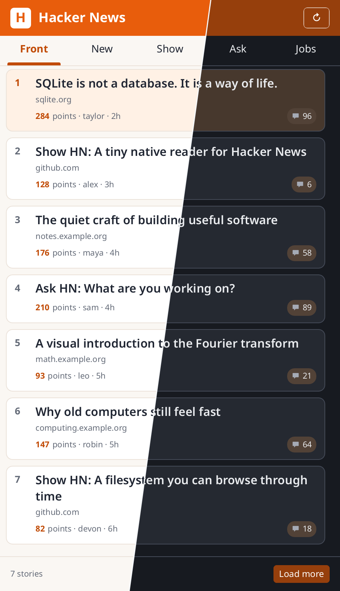
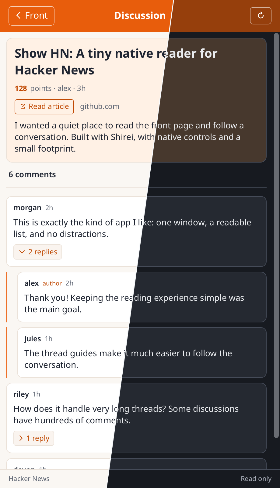

# hacker-news-reader

A small native Hacker News reader with ranked story lists and threaded comments.
Both screens follow the system light or dark appearance.



## Browsing

- **Feeds:** Custom full-width tabs switch between Front, New, Show, Ask, and Jobs.
  Stories come from the public Firebase API, with no API key.
- **Stories:** Ranked cards show the title, domain, points, author, age, and comment
  count. Click a row, or focus it and press Enter/Space, to open the discussion.
- **Loading:** Refresh reloads the feed. **Load more** in the bottom bar fetches
  the next page; the virtual list measures each row to fit wrapped titles.
- **Discussion:** The title, metadata, optional self-text, and comments scroll
  together. **Read article** opens the original URL in the system browser.
  The back button returns to the selected feed.
- **Replies:** A separate chevron button shows or hides direct replies. Comment
  text remains visible. Replies load on demand and stay cached for reopening.
  Indentation and orange guide lines show nesting; indentation is capped in
  deep threads to preserve reading space. The story author's comments carry
  an **author** label.
- **Appearance:** Surfaces, text, borders, and controls use the active color
  scheme. Orange accents identify the selected feed and reply controls.



## Run

From this directory:

```shell
go run .                       # live Hacker News
go run . --demo                 # offline sample stories and comments
go run . --png out.png          # front-page image; sample data if offline
go run . --demo --png out.png   # offline front-page image
go run . --png-post out.png     # offline discussion image
```

The offline demo uses the same sample stories for each feed. Refresh keeps
those samples unchanged. Live data requires network access; the Firebase API
is read-only and unauthenticated.

## Checks

```shell
go test .
```

Snapshots cover both color schemes at narrow and desktop widths. The native
window test opens a story, toggles replies with the pointer and keyboard, and
returns to the feed using offline data.
