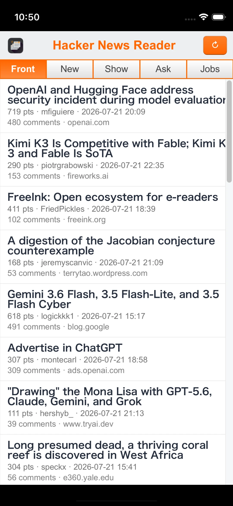

# hacker-news-reader

Browse Hacker News from a small Shirei app: feed filters, virtualized story
list, and a post screen with collapsible threaded comments.



## What it shows

- **Feeds** — Front, New, Show, Ask, Jobs via the public Firebase API
  (`hacker-news.firebaseio.com`), no API key
- **Segmented control** switches feed and reloads from the top
- **Virtual list** of stories; **More** at the bottom loads the next page
- **Post screen** — title, score, username, absolute timestamp (`yyyy-mm-dd hh:mm`),
  external URL (opens the system browser / Safari on iOS), optional self-text,
  and comments
- **Threaded comments** — depth indentation like `examples/dir_weight`; folded by
  default; expand a parent to load and show its replies (chevron + tap on meta)

## Run

```shell
go run .                 # inside examples/hacker-news-reader
go run . --png out.png   # headless front page (live HN API; sample if offline)
```

Network access is required for live data. The Firebase HN API is read-only and
unauthenticated.

## Layout sketch

```
Feed                          Post
┌─────────────────────┐       ┌─────────────────────┐
│ Hacker News  Refresh│       │ ← Back   title…     │
│ [Front|New|Show|…]  │       ├─────────────────────┤
├─────────────────────┤       │ title               │
│ story row           │  ──►  │ pts · user · time   │
│ story row           │       │ url (opens browser) │
│ …                   │       │ body                │
│ [ More ]            │       │ N comments          │
└─────────────────────┘       │   ▸ comment         │
                              │     nested comment  │
                              └─────────────────────┘
```

## Related

- `demos/browse` — smaller two-tab HN + Picsum demo this example grew out of
- `examples/dir_weight` — virtual list + expand/collapse tree pattern for comments
