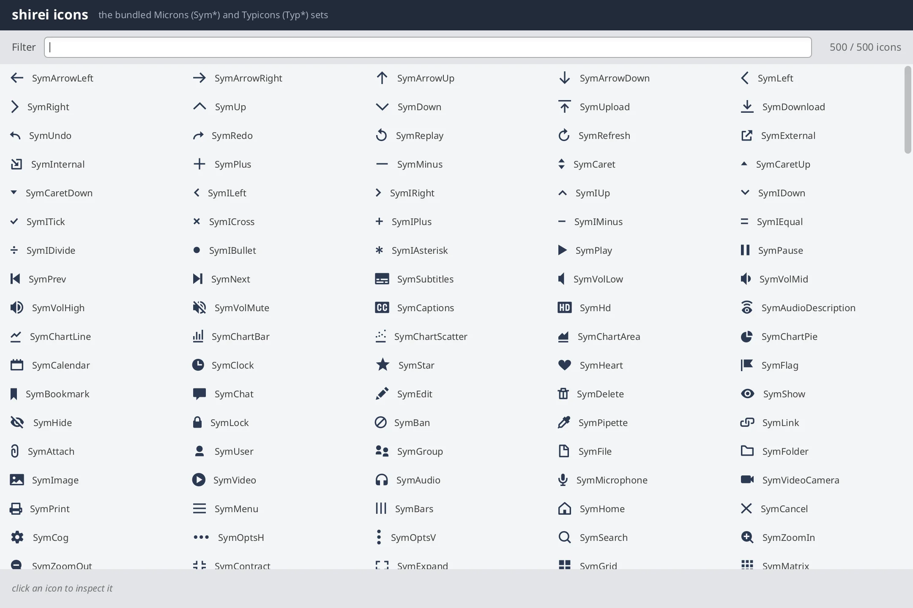

# icons

Filterable gallery of the icon fonts bundled with shirei.



## Bundled icon gallery

Every `Sym*` (Microns) and `Typ*` (Typicons) constant from the `widgets`
package, in a grid you can filter by name. Click an icon for a footer with the
glyph, family, codepoint, and a copy-paste usage snippet
(`Icon(Name)` / `Button(Name, "label")`). Double-click (or the copy control)
puts the constant name on the clipboard.

The icon table is generated (`//go:generate`) from the widgets sources so the
gallery stays in sync.

## Multi-column virtual grid

`VirtualListView` is one-dimensional. Column count is derived from the panel
width; each virtual row is a horizontal strip of cells.

```go
// main.go — IconGrid (simplified)
width := GetResolvedSize()[0]
if width <= 0 {
    RequestNextFrame()
    return
}
cols := max(1, int(width/cellWidth))
rows := (len(visible) + cols - 1) / cols

rowView := func(i int, w f32) {
    Container(Attrs(Row, Expand, FixHeight(cellHeight)), func() {
        start := i * cols
        for _, ic := range visible[start:min(start+cols, len(visible))] {
            IconCell(ic)
        }
    })
}
VirtualListView(nil, rows, rowId, rowHeight, rowView)
```

## Click selects, double-click copies

Cells are keyed by the `*NamedIcon` pointer so hover/selection follow the icon
when filtering regroups rows. Click sets selection; double-click copies the
constant name.

```go
// main.go — IconCell
ContainerWithKey(ic, Attrs(Row, CrossMid, Gap(8), /* … */), func() {
    if IsClicked() {
        selected = ic
    }
    if IsDoubleClicked() {
        copyIconName(ic) // RequestTextCopy at end of frame
    }
    Icon(ic.Sym, FontSize(20), /* … */)
    Label(ic.Name, FontSize(11), /* … */)
})
```

`RequestTextCopy` queues the clipboard write for after the frame — you do not
talk to the OS clipboard mid-layout.

## App shell

```go
app.SetupWindow("shirei icons", 1080, 720)
app.Run(RootView) // header → toolbar → grid → footer
```

## Run it

```shell
go run .                 # inside examples/icons
go run . --png out.png
```
