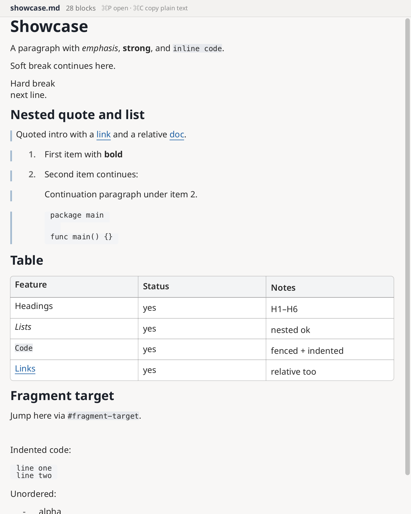

# markdown_viewer

Native Markdown viewer built on Shirei's text shaping and variable-height
virtual list. Goldmark parses CommonMark; the example lowers the AST into a
flat `[]DisplayItem` stream and paints one row builder over it.



## Run

```bash
go run .                       # empty state; ⌘/Ctrl+P to open
go run . path/to/notes.md
go run . --png out.png         # headless showcase (or pass a file)
go run . --width 420 --png out.png
```

## Keyboard

| Shortcut | Action |
|----------|--------|
| ⌘/Ctrl+P | Quick-open Markdown under the working directory |
| ⌘/Ctrl+C | Copy the whole document as plain text |

There is no drag-selection across rendered blocks in this version. Copy is the
whole-document plain-text shortcut above.

## What renders

Headings, paragraphs (soft break → space, hard break → line break), emphasis,
strong, inline code, links, ordered/unordered lists, blockquotes, thematic
breaks, GFM tables (one virtualized row per table row, equal column widths),
indented and fenced code blocks (one virtualized row per source line).

Link clicks:

- `http` / `https` / `mailto` → open externally
- relative `.md` paths → open in the viewer
- `#fragment` → scroll to the heading item
- other schemes → shown, not activated

Trailing clicks past a link (including whitespace after the link range) do not
activate.

## Reload and scroll

File changes reparse off the frame path. A newer generation discards a stale
parse. Opening another path scrolls to the top; reloading the same path keeps
the previous first-visible item index when possible.

## Layout note

Quote bars, list indent, and the marker column sit outside the text host. The
text host uses `MaxWidth(textBudget)` with no horizontal padding so measure and
paint share the same wrap width — including link hit-testing via
`ShapeTextMax` + `ComputeCursorIndex`.

## Scope

This is an example app, not a public `widgets.Markdown` API. Task lists, images,
syntax highlighting, math, raw HTML, and rendered drag-selection are out of
scope for now.
