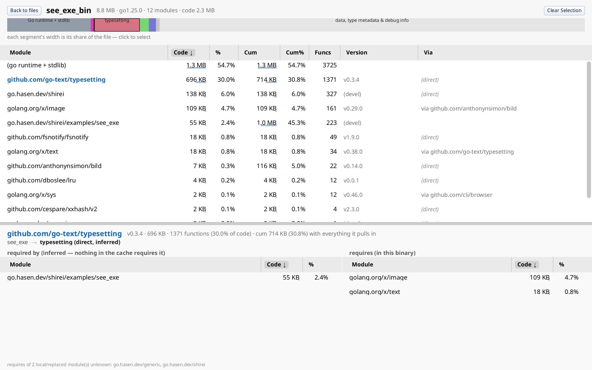

# see_exe

Inspect a built Go executable: which modules landed in the binary, and how much
code each one accounts for.



## Inspect modules in a Go binary

Open a Go binary (or launch with no args and pick from a list of recent builds
under the current tree). You get:

- A stacked bar of code size (stdlib / main / large deps / small pool / rest)
- A sortable module table: code bytes, %, cumulative, function count, version, path
- Click a module for a “why is this here?” detail: require-chain breadcrumb and
  requires / required-by edges (from the module cache when available)

Data comes only from the binary and the standard library
(`debug/buildinfo`, `debug/gosym`, Mach-O/ELF). No toolchain and no source tree
required on the machine doing the inspection. Rebuilds are picked up via
`fsnotify` while the window stays open.

CLI extras: `--text` for a terminal report; a second argument for a module
“why” query without the GUI. PE (Windows) binaries may appear in the picker but
full size attribution is not there yet.

## Draggable split

Panes do not use flex grow to “share space.” Each frame, the parent’s resolved
height is split by `mainSplitRatio`. A fixed-height strip in the middle is the
handle: `PressAction` + `IsActive` while the pointer moves adjusts the ratio.

```go
// gui.go — InspectView (simplified)
totalHeight := GetResolvedSize()[1]
topHeight := (totalHeight - splitterHeight) * mainSplitRatio

Container(Attrs(FixHeight(topHeight), Expand, Clip), func() {
    ModuleTable()
})

Container(Attrs(FixHeight(splitterHeight), Expand, Background(0, 0, 80, 1)), func() {
    PressAction()
    if IsActive() && totalHeight > 0 {
        mainSplitRatio = clampF32(
            mainSplitRatio+FrameInput.Motion[1]/(totalHeight-splitterHeight),
            0.15, 0.85,
        )
    }
})

Container(Attrs(FixHeight(totalHeight-splitterHeight-topHeight), Expand, Clip), func() {
    DetailPane()
})
```

On the first frame `GetResolvedSize()` can still be zero; the code requests
another frame and waits (`RequestNextFrame`).

## One selection field, many writers

```go
var selectedPath string
```

The stacked bar, module table, and detail breadcrumb all write `selectedPath`
and read it for highlight / detail content. Immediate mode: no selection
controller object.

## Screens and live reload

```go
if browsing {
    PickerView()
} else {
    InspectView()
}
```

Esc sets `browsing = true` and returns to the picker. `watchExe` debounces
filesystem events, reloads the model under the frame lock, and requests a
frame (`gui.go`).

## Run it

```shell
go run .                         # picker; inside examples/see_exe
go run . /path/to/binary
go run . /path/to/binary --text
go run . /path/to/binary some.module/path
go run . --png out.png
```
