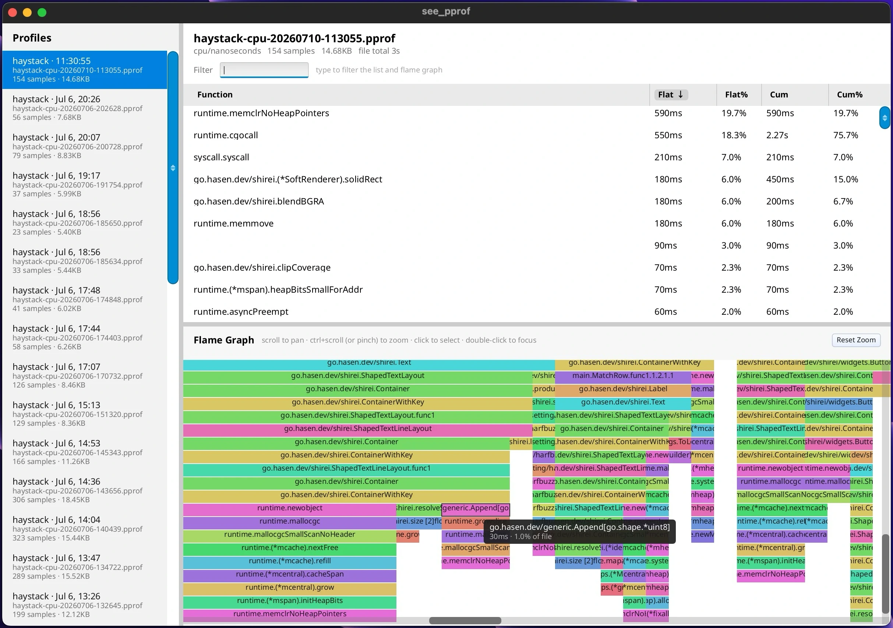

# see_pprof

Native viewer for Go `pprof` profiles — a small alternative to
`go tool pprof -http`.



## What it does

Point it at a directory (it starts on the current working directory). The
sidebar lists `*.pprof` files, newest first, and **keeps watching** so new
profiles from other processes appear without a restart.

Select a profile for:

- Sortable top-functions table (flat / cumulative)
- Interactive flame graph: scroll to pan, ctrl+scroll or pinch to zoom, click
  to select, double-click to focus a subtree
- Shared search filter across table and flame
- Caller/callee **Peek** (who calls this, what it calls) without leaving the window

No browser tab, no local HTTP server. With `DEBUG=1`, a floating
`ProfileButton` can capture a CPU profile of this app (or any other shirei app
that embeds the same widget) and drop a `.pprof` next to you to open.

## What it shows (shirei)

Custom “canvas” drawing, table + selection conventions, and scoped ephemeral UI
state keyed to data identity. Dense, but the pieces are reusable.

### Scoped state with `ContainerWithKey` + `UseWithInit`

Flame pan/zoom/focus live in a `FlameState` created with `UseWithInit`, inside
a container keyed by `flameRoot`. Switching profiles changes the key, so zoom
state resets with the tree instead of leaking across files.

```go
ContainerWithKey(appData.flameRoot, Attrs(...), func() {
    state := UseWithInit[FlameState]("flame-state", func() *FlameState {
        return &FlameState{scale: 1}
    })
    // ...
})
```

See `main.go`: `MainContent`.

### Caching off the tree with `UseData`

Sidebar file metadata is parsed once per name/mtime and stored via `UseData`,
so directory rescans do not re-parse every profile every frame.

See `main.go`: `cachedProfileFileInfo`.

### Flame graph as floated geometry

`FlameGraph` does not use flex children for frames. It lays out rectangles with
`Float`, culls off-screen work, and hit-tests for click/hover. Tooltip uses
`ClickThrough` so it does not steal interaction. Pattern for any custom plot.

See `main.go`: `FlameGraph`.

### Click vs double-click shared by table and flame

Click selects a function in both views; double-click peeks or focuses. Keep
those conventions consistent when two panes show the same selection.

See `main.go`: `NameCell`, flame click handling near the end of `FlameGraph`.

### Identity tip for virtual tables

Peek’s caller/callee tables key rows by pointer, not by function name string —
string ids can collide or fight recycling when the same name appears in
different roles. Comment in the peek table setup is worth reading if you build
your own virtual lists.

## Run it

```shell
go run .                 # inside examples/see_pprof; watches cwd
go run . --png out.png   # uses newest .pprof if present
DEBUG=1 go run .         # also shows the in-app profiler toggle
```
